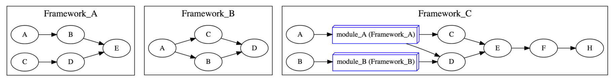
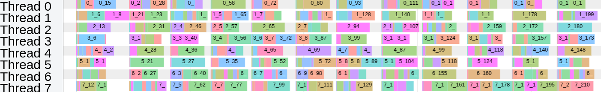
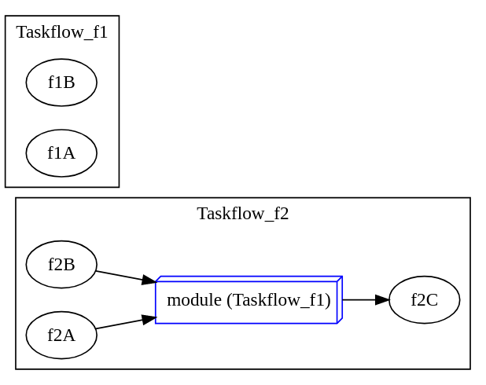

# Cpp-Taskflow 

[](https://app.codacy.com/app/tsung-wei-huang/cpp-taskflow?utm_source=github.com&utm_medium=referral&utm_content=cpp-taskflow/cpp-taskflow&utm_campaign=Badge_Grade_Dashboard)
[](https://travis-ci.com/cpp-taskflow/cpp-taskflow)
[](https://ci.appveyor.com/project/TsungWeiHuang/cpp-taskflow)
[](https://en.wikipedia.org/wiki/C%2B%2B#Standardization)
[](https://github.com/cpp-taskflow/cpp-taskflow/archive/master.zip)
[][wiki]
[](./awesome-parallel-computing.md)

A fast C++ *header-only* library to help you quickly write parallel programs with complex task dependencies

# Why Cpp-Taskflow?

Cpp-Taskflow is by far faster, more expressive, and easier for drop-in integration
than existing parallel task programming libraries such as [OpenMP Tasking][OpenMP Tasking] 
and Intel [TBB FlowGraph][TBB FlowGraph] in handling complex parallel workloads.


Cpp-Taskflow lets you quickly implement task decomposition strategies
that incorporate both regular and irregular compute patterns,
together with an efficient *work-stealing* scheduler to optimize your multithreaded performance.

| Without Cpp-Taskflow | With Cpp-Taskflow |
| -------------------- | ----------------- |
|  |  |

Cpp-Taskflow has a unified interface for both *static* tasking and *dynamic* tasking,
allowing users to quickly master our parallel task programming model in a natural idiom.

| Static Tasking | Dynamic Tasking |
| :------------: | :-------------: |
|  |  |

Cpp-Taskflow provides a composable task dependency graph interface 
to enable high performance and high developer productivity at the same time.



Cpp-Taskflow let users easily monitor the thread activities and analyze their programs' performance through [chrome://tracing][ChromeTracing].



Cpp-Taskflow is part of the [DARPA IDEA research program][DARPA IDEA]. We are committed to support trustworthy developments for both academic and industrial research projects in parallel computing. Check out [Who is Using Cpp-Taskflow](#who-is-using-cpp-taskflow) and what our users say:

+ *"Cpp-Taskflow is the cleanest Task API I've ever seen." [damienhocking][damienhocking]*
+ *"Cpp-Taskflow has a very simple and elegant tasking interface. The performance also scales very well." [totalgee][totalgee]*
+ *"Cpp-Taskflow lets me handle parallel processing in a smart way." [Hayabusa](https://cpp-learning.com/cpp-taskflow/)*
+ *"Best poster award for open-source parallel programming library." [Cpp Conference 2018][Cpp Conference 2018]*

See a quick [presentation][Presentation] and 
visit the [documentation][wiki] to learn more about Cpp-Taskflow.
Technical details can be referred to our [IEEE IPDPS19 paper][IPDPS19].

:exclamation: Notice that starting at v2.2.0 (including this master branch) 
we isolated the executor interface from Taskflow to improve the programming model and performance.
This caused a few breaks in using Cpp-Taskflow.
Please refer to [release-notes](https://cpp-taskflow.github.io/cpp-taskflow/release-2-2-0.html)
for adapting to this new change.

# Table of Contents

* [Get Started with Cpp-Taskflow](#get-started-with-cpp-taskflow)
* [Create a Taskflow Application](#create-a-taskflow-application)
   * [Step 1: Create a Taskflow](#step-1-create-a-taskflow)
   * [Step 2: Define Task Dependencies](#step-2-define-task-dependencies)
   * [Step 3: Execute a Taskflow](#step-3-execute-a-taskflow)
* [Dynamic Tasking](#dynamic-tasking)
   * [Step 1: Create a Subflow](#step-1-create-a-subflow)
   * [Step 2: Detach or Join a Subflow](#step-2-detach-or-join-a-subflow)
* [Taskflow Composition](#taskflow-composition)
* [Debug a Taskflow Graph](#debug-a-taskflow-graph)
* [Monitor Thread Activities](#monitor-thread-activities)
* [API Reference](#api-reference)
* [Caveats](#caveats)
* [System Requirements](#system-requirements)
* [Compile Unit Tests and Examples](#compile-unit-tests-and-examples)
* [Get Involved](#get-involved)
* [Who is Using Cpp-Taskflow?](#who-is-using-cpp-taskflow)
* [Contributors](#contributors)


# Get Started with Cpp-Taskflow

The following example [simple.cpp](./example/simple.cpp) shows the basic Cpp-Taskflow API
you need in most applications.

```cpp
#include <taskflow/taskflow.hpp>  // Cpp-Taskflow is header-only

int main(){
  
  tf::Executor executor;
  tf::Taskflow taskflow;

  auto [A, B, C, D] = taskflow.emplace(
    [] () { std::cout << "TaskA\n"; },               //  task dependency graph
    [] () { std::cout << "TaskB\n"; },               // 
    [] () { std::cout << "TaskC\n"; },               //          +---+          
    [] () { std::cout << "TaskD\n"; }                //    +---->| B |-----+   
  );                                                 //    |     +---+     |
                                                     //  +---+           +-v-+ 
  A.precede(B);  // A runs before B                  //  | A |           | D | 
  A.precede(C);  // A runs before C                  //  +---+           +-^-+ 
  B.precede(D);  // B runs before D                  //    |     +---+     |    
  C.precede(D);  // C runs before D                  //    +---->| C |-----+    
                                                     //          +---+          
  executor.run(taskflow).wait();

  return 0;
}
```

Compile and run the code with the following commands:

```bash
~$ g++ simple.cpp -std=c++1z -O2 -lpthread -o simple
~$ ./simple
TaskA
TaskC  <-- concurrent with TaskB
TaskB  <-- concurrent with TaskC
TaskD
```

It is clear now Cpp-Taskflow is powerful in parallelizing tasks with complex dependencies.
The following example demonstrates a concurrent execution of 10 tasks with 15 dependencies.
With Cpp-Taskflow, you only need ***15 lines of code***.


```cpp
// source dependencies
S.precede(a0);    // S runs before a0
S.precede(b0);    // S runs before b0
S.precede(a1);    // S runs before a1

// a_ -> others
a0.precede(a1);   // a0 runs before a1
a0.precede(b2);   // a0 runs before b2
a1.precede(a2);   // a1 runs before a2
a1.precede(b3);   // a1 runs before b3
a2.precede(a3);   // a2 runs before a3

// b_ -> others
b0.precede(b1);   // b0 runs before b1
b1.precede(b2);   // b1 runs before b2
b2.precede(b3);   // b2 runs before b3
b2.precede(a3);   // b2 runs before a3

// target dependencies
a3.precede(T);    // a3 runs before T
b1.precede(T);    // b1 runs before T
b3.precede(T);    // b3 runs before T
```

# Create a Taskflow Application

Cpp-Taskflow defines a very expressive API to create task dependency graphs.
Most applications are developed through the following three steps.

## Step 1: Create a Taskflow

Create a taskflow object to build a task dependency graph:

```cpp
tf::Taskflow taskflow;
```

A task is a callable object for which [std::invoke][std::invoke] is applicable.
Use the method `emplace` to create a task:

```cpp
tf::Task A = taskflow.emplace([](){ std::cout << "Task A\n"; });
```

You can create multiple tasks at one time:

```cpp
auto [A, B, C, D] = taskflow.emplace(
  [] () { std::cout << "Task A\n"; },
  [] () { std::cout << "Task B\n"; },
  [] () { std::cout << "Task C\n"; },
  [] () { std::cout << "Task D\n"; }
);
```

## Step 2: Define Task Dependencies

You can add dependency links between tasks to enforce one task to run after another.
The dependency graph must be a
[Directed Acyclic Graph (DAG)](https://en.wikipedia.org/wiki/Directed_acyclic_graph).
The handle `Task` supports different methods for you to describe task dependencies.

**Precede**: Adding a preceding link forces one task to run before another.
```cpp
A.precede(B);  // A runs before B.
```

**Gather**: Adding a gathering link forces one task to run after another.
```cpp
A.gather(B);  // A runs after B
```

## Step 3: Execute a Taskflow

To execute a taskflow, you need to create an *executor*.
An executor manages a set of worker threads to execute a taskflow
through an efficient *work-stealing* algorithm.

```cpp
tf::Executor executor;    
```

The executor provides a rich set of methods to run a taskflow. 
You can run a taskflow multiple times, or until a stopping criteria is met.
These methods are non-blocking with a [std::future][std::future] return
to let you query the execution status.
All methods are *thread-safe*.

```cpp 
executor.run(taskflow);                                              // run the taskflow once
executor.run(taskflow, [](){ std::cout << "done 1 run\n"; } );       // run once with a callback
executor.run_n(taskflow, 4);                                         // run four times
executor.run_n(taskflow, 4, [](){ std::cout << "done 4 runs\n"; });  // run 4 times with a callback

// run n times until the predicate becomes true
executor.run_until(taskflow, [counter=4](){ return --counter == 0; } );

// run n times until the predicate becomes true and invoke the callback on completion
executor.run_until(taskflow, [counter=4](){ return --counter == 0; }, 
                             [](){ std::cout << "Execution finishes\n"; } );
```


You can call `wait_for_all` to block the executor until all associated taskflows complete.

```cpp
executor.wait_for_all();  // block until all associated tasks finish
```

Notice that executor does not own any taskflow. 
It is your responsibility to keep a taskflow alive during its execution,
or it can result in undefined behavior.
In most applications, you need only one executor to run multiple taskflows
each representing a specific part of your parallel decomposition.

# Dynamic Tasking

Another powerful feature of Taskflow is *dynamic* tasking.
Dynamic tasks are those tasks created during the execution of a taskflow.
These tasks are spawned by a parent task and are grouped together to a *subflow* graph.
The example below demonstrates how to create a subflow
that spawns three tasks at runtime.


```cpp
// create three regular tasks
tf::Task A = tf.emplace([](){}).name("A");
tf::Task C = tf.emplace([](){}).name("C");
tf::Task D = tf.emplace([](){}).name("D");

// create a subflow graph (dynamic tasking)
tf::Task B = tf.emplace([] (tf::Subflow& subflow) {
  tf::Task B1 = subflow.emplace([](){}).name("B1");
  tf::Task B2 = subflow.emplace([](){}).name("B2");
  tf::Task B3 = subflow.emplace([](){}).name("B3");
  B1.precede(B3);
  B2.precede(B3);
}).name("B");
            
A.precede(B);  // B runs after A 
A.precede(C);  // C runs after A 
B.precede(D);  // D runs after B 
C.precede(D);  // D runs after C 
```

By default, a subflow graph joins its parent node. 
This ensures a subflow graph finishes before the successors of 
its parent task.
You can disable this feature by calling `subflow.detach()`.
For example, detaching the above subflow will result in the following execution flow:


```cpp
// create a "detached" subflow graph (dynamic tasking)
tf::Task B = tf.emplace([] (tf::Subflow& subflow) {
  tf::Task B1 = subflow.emplace([](){}).name("B1");
  tf::Task B2 = subflow.emplace([](){}).name("B2");
  tf::Task B3 = subflow.emplace([](){}).name("B3");
  B1.precede(B3);
  B2.precede(B3);

  // detach this subflow from task B
  subflow.detach();
}).name("B");
```

## Step 1: Create a Subflow

Cpp-Taskflow has an unified interface for static and dynamic tasking.
To create a subflow for dynamic tasking, 
emplace a callable with one argument of type `tf::Subflow`.

```cpp
tf::Task A = tf.emplace([] (tf::Subflow& subflow) {});
```

A subflow is a lightweight object that allows you to create 
arbitrary dependency graphs at runtime.
All graph building methods defined in taskflow
can be used in the subflow.

```cpp
tf::Task A = tf.emplace([] (tf::Subflow& subflow) {
  std::cout << "Task A is spawning two subtasks A1 and A2" << '\n';
  auto [A1, A2] = subflow.emplace(
    [] () { std::cout << "subtask A1" << '\n'; },
    [] () { std::cout << "subtask A2" << '\n'; }
    A1.precede(A2);
  );
});
```

A subflow can be nested or recursive. You can create another subflow from
the execution of a subflow and so on.


```cpp
tf::Task A = tf.emplace([] (tf::Subflow& sbf) {
  std::cout << "A spawns A1 & subflow A2\n";
  tf::Task A1 = sbf.emplace([] () { 
    std::cout << "subtask A1\n"; 
  }).name("A1");

  tf::Task A2 = sbf.emplace([] (tf::Subflow& sbf2) {
    std::cout << "A2 spawns A2_1 & A2_2\n";
    tf::Task A2_1 = sbf2.emplace([] () { 
      std::cout << "subtask A2_1\n"; 
    }).name("A2_1");
    tf::Task A2_2 = sbf2.emplace([] () { 
      std::cout << "subtask A2_2\n"; 
    }).name("A2_2");
    A2_1.precede(A2_2);
  }).name("A2");

  A1.precede(A2);
}).name("A");
```

## Step 2: Detach or Join a Subflow

A subflow will run after leaving the execution context of its parent task.
By default, a subflow joins to its parent task.
Depending on applications, you can detach a subflow to enable more parallelism.

```cpp
tf::Task A = tf.emplace([] (tf::Subflow& subflow) {
  subflow.detach();  // detach this subflow from its parent task A
});  // subflow starts to run after the callable scope
```

Detaching or joining a subflow has different meaning in the completion status of 
its parent node.
In a joined subflow, 
the completion of its parent node is defined as when all tasks
inside the subflow (possibly nested) finish.


```cpp
int value {0};

// create a joined subflow
tf::Task A = tf.emplace([&] (tf::Subflow& subflow) {
  subflow.emplace([&]() { 
    value = 10; 
  }).name("A1");
}).name("A");

// create a task B after A
tf::Task B = tf.emplace([&] () { 
  assert(value == 10); 
}).name("B");

// A1 must finish before A and therefore before B
A.precede(B);
```

When a subflow is detached from its parent task, it becomes a parallel
execution line to the current flow graph and will eventually
join the same taskflow.


```cpp
int value {0};

// create a detached subflow
tf::Task A = tf.emplace([&] (tf::Subflow& subflow) {
  subflow.emplace([&]() { value = 10; }).name("A1");
  subflow.detach();
}).name("A");

// create a task B after A
tf::Task B = tf.emplace([&] () { 
  // no guarantee for value to be 10
}).name("B");

A.precede(B);
```

# Taskflow Composition

A powerful feature of `tf::Taskflow` is its composability. 
You can create multiple task graphs from different parts of your workload
and use them to compose a large graph through the `composed_of` method. 




```cpp 
tf::Taskflow f1, f2;

// Add two tasks 
auto [f1A, f1B] = f1.emplace( 
  []() { std::cout << "Task f1A\n"; },
  []() { std::cout << "Task f1B\n"; }
);

// Add two tasks 
auto [f2A, f2B, f2C] = f2.emplace( 
  []() { std::cout << "Task f2A\n"; },
  []() { std::cout << "Task f2B\n"; },
  []() { std::cout << "Task f2C\n"; }
);

// Use f1 to compose f2
auto f1_module_task = f2.composed_of(f1);

f2A.precede(f1_module_task);
f2B.precede(f1_module_task);
f1_module_task.precede(f2C);
```

Similarly, `composed_of` returns a task handle and you can use the methods 
`precede` and `gather` to create dependencies. 
You can compose a taskflow from multiple taskflows and use the result
to compose a larger taskflow and so on.

# Debug a Taskflow Graph

Concurrent programs are notoriously difficult to debug.
To debug a taskflow graph, we suggest: 
(1) name each task and dump the graph, and
(2) start with one thread before going multiple.

## Dump a Taskflow Graph

You can dump a taskflow in [GraphViz][GraphViz] format using the method `dump`.

```cpp
// debug.cpp
tf::Taskflow taskflow;

tf::Task A = taskflow.emplace([] () {}).name("A");
tf::Task B = taskflow.emplace([] () {}).name("B");
tf::Task C = taskflow.emplace([] () {}).name("C");
tf::Task D = taskflow.emplace([] () {}).name("D");
tf::Task E = taskflow.emplace([] () {}).name("E");

A.precede(B, C, E); 
C.precede(D);
B.precede(D, E); 

taskflow.dump(std::cout);
```

Run the program and inspect whether dependencies are expressed in the right way. 
There are a number of free [GraphViz tools][AwesomeGraphViz] you could find online
to visualize your Taskflow graph.


```bash
~$ ./debug

// Taskflow with five tasks and six dependencies
digraph Taskflow {
  "A" -> "B"
  "A" -> "C"
  "A" -> "E"
  "B" -> "D"
  "B" -> "E"
  "C" -> "D"
}
```

## Dump a Subflow Graph

When you have dynamic tasks (subflows),
you cannot simply use the `dump` method because it displays only the static portion.
Instead, you need to execute the graph first to spawn dynamic tasks.


```cpp
tf::Executor executor;
tf::Taskflow taskflow;

tf::Task A = taskflow.emplace([](){}).name("A");

// create a subflow of two tasks B1->B2
tf::Task B = taskflow.emplace([] (tf::Subflow& subflow) {
  tf::Task B1 = subflow.emplace([](){}).name("B1");
  tf::Task B2 = subflow.emplace([](){}).name("B2");
  B1.precede(B2);
}).name("B");

A.precede(B);

executor.run(tf).wait();  // run the taskflow
tf.dump(std::cout);       // dump the graph including dynamic tasks
```

# Monitor Thread Activities 

Understanding thread activities is very important for performance analysis. 
Cpp-Taskflow provides a default *observer* of type `tf::ExecutorObserver` 
that lets users observe when a thread starts or stops participating in task scheduling.

```cpp 
tf::executor executor;
auto observer = executor.make_observer<tf::ExecutorObserver>();
```

When you are running a task dependency graph,
the observer will automatically record the start and end timestamps of each executed task.
You can dump the entire execution timelines into a JSON file.

```cpp 
executor.run(taskflow1);               // run a task dependency graph 1
executor.run(taskflow2);               // run a task dependency graph 2
executor.wait_for_all();               // block until all tasks finish

std::ofstream ofs("timestamps.json");
observer->dump(ofs);                   // dump the timeline to a JSON file
```

You can open the chrome browser to visualize the execution timelines through the 
[chrome://tracing][ChromeTracing] developer tool. 
In the tracing view, click the `Load` button to read the JSON file. 
You shall see the tracing graph.


Each task is given a name of `i_j` where `i` is the thread id and `j` is the task number.
You can pan or zoom in/out the timeline to get into a detailed view.

# API Reference

The official [documentation][wiki] explains a complete list of 
Cpp-Taskflow API. 
In this section, we highlight a short list of commonly used methods.

## Taskflow API

The class `tf::Taskflow` is the main place to create a task dependency graph.
The table below summarizes a list of commonly used methods.

| Method   | Argument  | Return  | Description |
| -------- | --------- | ------- | ----------- |
| emplace  | callables | tasks   | create a task with a given callable(s) |
| placeholder     | none        | task         | insert a node without any work; work can be assigned later |
| parallel_for    | beg, end, callable, partitions | task pair | apply the callable in parallel and partition-by-partition to the result of dereferencing every iterator in the range | 
| parallel_for    | beg, end, step, callable, partitions | task pair | apply the callable in parallel and partition-by-partition to a index-based range | 
| reduce | beg, end, res, bop | task pair | reduce a range of elements to a single result through a binary operator | 
| transform_reduce | beg, end, res, bop, uop | task pair | apply a unary operator to each element in the range and reduce them to a single result through a binary operator | 
| num_workers     | none        | size | query the number of working threads in the pool |  
| dump            | ostream     | none | dump the taskflow to an output stream in GraphViz format |

### *emplace/placeholder*

You can use `emplace` to create a task from a target callable.

```cpp
// create a task through emplace
tf::Task task = tf.emplace([] () { std::cout << "my task\n"; });
```

When task cannot be determined beforehand, you can create a placeholder and assign the calalble later.

```cpp
// create a placeholder and use it to build dependency
tf::Task A = tf.emplace([](){});
tf::Task B = tf.placeholder();
A.precede(B);

// assign the callable later in the control flow
B.work([](){ /* do something */ });
```

### *parallel_for*

The method `parallel_for` creates a subgraph that applies the callable to each item in the given range of
a container.


```cpp
// apply callable to each container item in parallel
auto v = {'A', 'B', 'C', 'D'};
auto [S, T] = tf.parallel_for(
  v.begin(),    // beg of range
  v.end(),      // end of range
  [] (int i) { 
    std::cout << "parallel in " << i << '\n';
  }
);
// add dependencies via S and T.
```

Partition size can affect the parallelism both inside and outside a partition.
Depending on applications, different group sizes can result in significant performance hit.


```cpp
// apply callable to two container items at a time in parallel
auto v = {'A', 'B', 'C', 'D'};
auto [S, T] = tf.parallel_for(
  v.begin(),    // beg of range
  v.end(),      // end of range
  [] (int i) { 
    std::cout << "AB and CD run in parallel" << '\n';
  },
  2  // partition the range to two groups
);
```

By default, taskflow performs an even partition over the maximum hardware concurrency
if the partition size is not specified (or equal to 0).

In addition to range-based iterator, `parallel_for` has another overload of index-based loop.
The first three argument to this overload indicates 
starting index, ending index (exclusive), and step size.

```cpp
// [0, 10) with a step size of 2
auto [S, T] = tf.parallel_for(
  0, 10, 2, 
  [] (int i) {
    std::cout << "parallel_for on index " << i << std::endl;
  }, 
  2  // partition the range to two
);
// will print 0, 2, 4, 6, 8 (three partitions, {0, 2}, {4, 6}, {8})
```

You can also go opposite direction by reversing the starting index and the ending index
with a negative step size.

```cpp
// [10, 0) with a step size of -2
auto [S, T] = tf.parallel_for(
  10, 0, 2, 
  [] (int i) {
    std::cout << "parallel_for on index " << i << std::endl;
  }
);
// will print 10, 8, 6, 4, 2 (partition size decided by taskflow)
```

### *reduce/transform_reduce*

The method `reduce` creates a subgraph that applies a binary operator to a range of items.
The result will be stored in the referenced `res` object passed to the method. 
It is your responsibility to assign a correct initial value to the reduce call.


```cpp
auto v = {1, 2, 3, 4}; 
int sum {0};
auto [S, T] = tf.reduce(    // for example, 2 threads
  v.begin(), v.end(), sum, std::plus<int>()
);  
```

The method `transform_reduce` is similar to reduce, except it applies a unary operator before reduction.
This is particular useful when you need additional data processing to reduce a range of elements.

```cpp
std::vector<std::pair<int, int>> v = { {1, 5}, {6, 4}, {-6, 4} };
int min = std::numeric_limits<int>::max();
auto [S, T] = tf.transform_reduce(v.begin(), v.end(), min, 
  [] (int l, int r) { return std::min(l, r); },
  [] (const std::pair<int, int>& pair) { return std::min(p.first, p.second); }
);
```

By default, all reduce methods distribute the workload evenly across `std::thread::hardware_concurrency`.

## Task API

Each time you create a task, the taskflow object adds a node to the present task dependency graph
and return a *task handle* to you.
A task handle is a lightweight object that defines a set of methods for users to
access and modify the attributes of the associated task.
The table below summarizes a list of commonly used methods.

| Method         | Argument    | Return | Description |
| -------------- | ----------- | ------ | ----------- |
| name           | string      | self   | assign a human-readable name to the task |
| work           | callable    | self   | assign a work of a callable object to the task |
| precede        | task list   | self   | enable this task to run *before* the given tasks |
| gather         | task list   | self   | enable this task to run *after* the given tasks |
| num_dependents | none        | size   | return the number of dependents (inputs) of this task |
| num_successors | none        | size   | return the number of successors (outputs) of this task |

### *name*

The method `name` lets you assign a human-readable string to a task.

```cpp
A.name("my name is A");
```

### *work*

The method `work` lets you assign a callable to a task.

```cpp
A.work([] () { std::cout << "hello world!"; });
```

### *precede*

The method `precede` lets you add a preceding link from self to a task.


```cpp
// make A runs before B
A.precede(B);
```

You can precede multiple tasks at one time.


```cpp
// make A run before B, C, D, and E
// B, C, D, and E run in parallel
A.precede(B, C, D, E);
```

### *gather*

The method `gather` lets you add a preceding link from a task to self.


```cpp
// B, C, D, and E run in parallel
// A runs after B, C, D, and E complete
A.gather(B, C, D, E);
```

## Executor API

The class `tf::Executor` is used for execution of one or multiple taskflow objects.
The table below summarizes a list of commonly used methods. 

| Method    | Argument       | Return        | Description              |
| --------- | -------------- | ------------- | ------------------------ |
| Executor  | N              | none          | construct an executor with N worker threads |
| run       | taskflow       | future | run the taskflow once    |
| run_n     | taskflow, N    | future | run the taskflow N times |
| run_until | taskflow, binary predicate | future | keep running the task until the predicate returns true |
| make_observer | arguments to forward to user-derived constructor | pointer to the observer | create an observer to monitor the thread activities of the executor |

### *Executor*

The constructor of tf::Executor takes an unsigned integer to 
initialize the executor with `N` worker threads.

```cpp
tf::Executor executor(8);  // create an executor of 8 worker threads
```

The default value uses `std::thread::hardware_concurrency` 
to decide the number of worker threads.

### *run/run_n/run_until*

The run series are non-blocking call to execute a taskflow graph.
Issuing multiple runs on the same taskflow will automatically synchronize 
to a sequential chain of executions.

```cpp
executor.run(taskflow);             // run a graph once
executor.run_n(taskflow, 5);        // run a graph five times
executor.run_n(taskflow, my_pred);  // keep running a graph until the predicate becomes true
```

The first run finishes before the second run, and the second run finishes before the third run.

# Caveats

While Cpp-Taskflow enables the expression of very complex task dependency graph that might contain 
thousands of task nodes and links, there are a few amateur pitfalls and mistakes to be aware of.

+ Having a cycle in a graph may result in running forever
+ Destructing a taskflow while it is running in one execution results in undefined behavior
+ Trying to modify a running task can result in undefined behavior
+ Touching a taskflow or an executor from multiple threads is not safe

Cpp-Taskflow is known to work on Linux distributions, MAC OSX, and Microsoft Visual Studio.
Please [let me know][email me] if you found any issues in a particular platform.

# System Requirements

To use Cpp-Taskflow, you only need a [C++17][C++17] compiler:
+ GNU C++ Compiler v7.3 with -std=c++1z
+ Clang C++ Compiler v6.0 with -std=c++17
+ Microsoft Visual Studio Version 15.7 (MSVC++ 19.14)

# Compile Unit Tests and Examples

Cpp-Taskflow uses [CMake](https://cmake.org/) to build examples and unit tests.
We recommend using out-of-source build.

```bash
~$ cmake --version  # must be at least 3.9 or higher
~$ mkdir build
~$ cd build
~$ cmake ../
~$ make 
```

## Unit Tests

Cpp-Taskflow uses [Doctest](https://github.com/onqtam/doctest) for unit tests.

```bash
~$ ./unittest/taskflow
```

Alternatively, you can use CMake's testing framework to run the unittest.

```bash
~$ cd build
~$ make test
```

## Examples

The folder `example/` contains several examples and is a great place to learn to use Cpp-Taskflow.

| Example |  Description |
| ------- |  ----------- | 
| [simple.cpp](./example/simple.cpp) | uses basic task building blocks to create a trivial taskflow  graph |
| [debug.cpp](./example/debug.cpp)| inspects a taskflow through the dump method |
| [parallel_for.cpp](./example/parallel_for.cpp)| parallelizes a for loop with unbalanced workload |
| [reduce.cpp](./example/reduce.cpp)| performs reduce operations over linear containers |
| [subflow.cpp](./example/subflow.cpp)| demonstrates how to create a subflow graph that spawns three dynamic tasks |
| [run_variants.cpp](./example/run_variants.cpp)| shows multiple ways to run a taskflow graph |
| [composition.cpp](./example/composition.cpp)| demonstrates the decomposable interface of taskflow |
| [observer.cpp](./example/observer.cpp)| demonstrates how to monitor the thread activities in scheduling and running tasks |

# Get Involved

+ Report bugs/issues by submitting a [GitHub issue][GitHub issues]
+ Submit contributions using [pull requests][GitHub pull requests]
+ Learn more about Cpp-Taskflow by reading the [documentation][wiki]
+ Release notes are highlighted [here][release notes]
+ Read and cite our [IPDPS19][IPDPS19] paper
+ Visit a curated list of [awesome parallel computing resources](awesome-parallel-computing.md)

# Who is Using Cpp-Taskflow?

Cpp-Taskflow is being used in both industry and academic projects to scale up existing workloads 
that incorporate complex task dependencies. 

- [OpenTimer][OpenTimer]: A High-performance Timing Analysis Tool for Very Large Scale Integration (VLSI) Systems
- [DtCraft][DtCraft]: A General-purpose Distributed Programming Systems using Data-parallel Streams
- [Firestorm][Firestorm]: Fighting Game Engine with Asynchronous Resource Loaders (developed by [ForgeMistress][ForgeMistress])
- [Shiva][Shiva]: An extensible engine via an entity component system through scripts, DLLs, and header-only (C++)
- [PID Framework][PID Framework]: A Global Development Methodology Supported by a CMake API and Dedicated C++ Projects 
- [NovusCore][NovusCore]: An emulating project for World of Warcraft (Wrath of the Lich King 3.3.5a 12340 client build)
- [SA-PCB][SA-PCB]: Annealing-based Printed Circuit Board (PCB) Placement Tool
- [LPMP](https://github.com/LPMP/LPMP): A C++ framework for developing scalable Lagrangean decomposition solvers for discrete optimization problems

[More...](https://github.com/search?q=cpp-taskflow&type=Code)

# Contributors

Cpp-Taskflow is being actively developed and contributed by the following people:

- [Tsung-Wei Huang][Tsung-Wei Huang] created the Cpp-Taskflow project and implemented the core routines
- [Chun-Xun Lin][Chun-Xun Lin] co-created the Cpp-Taskflow project and implemented the core routines
- [Martin Wong][Martin Wong] supported the Cpp-Taskflow project through NSF and DARPA funding
- [Andreas Olofsson][Andreas Olofsson] supported the Cpp-Taskflow project through the DARPA IDEA project
- [Nan Xiao](https://github.com/NanXiao) fixed compilation error of unittest on the Arch platform
- [Vladyslav](https://github.com/innermous) fixed comment errors in README.md and examples
- [vblanco20-1](https://github.com/vblanco20-1) fixed compilation error on Microsoft Visual Studio
- [Glen Fraser](https://github.com/totalgee) created a standalone C++14-compatible [threadpool](./taskflow/threadpool/threadpool_cxx14.hpp) for taskflow; various other fixes and examples
- [Guannan Guo](https://github.com/gguo4) added different threadpool implementations to enhance the performance for taskflow
- [Patrik Huber][Patrik Huber] helped fixed typos in the documentation
- [ForgeMistress][ForgeMistress] provided API ideas about sharing the executor to avoid thread over-subscription issues
- [Alexander Neumann](https://github.com/Neumann-A) helped modify the cmake build to make Cpp-Taskflow importable from external cmake projects
- [Paolo Bolzoni](https://github.com/paolobolzoni) helped remove extraneous semicolons to suppress extra warning during compilation and contributed to a dataflow example
- [Pursche](https://github.com/Pursche) fixed compilation warning on Microsoft Visual Studio
- [KingDuckZ][KingDuckZ] helped discover the memory leak in the memory allocator used in graph and topology
- [mrogez-yseop](https://github.com/mrogez-yseop) helped fix the missing comma in outputting the execution timeline JSON from the observer
- [Sztergbaum Roman](https://github.com/Milerius) replaced the error-prone global setting in cmake with project-specific targets

Meanwhile, we appreciate the support from many organizations for our development on Cpp-Taskflow.
Please [let me know][email me] if I forgot someone!

| [][UIUC] | [][CSL] | [][NSF] | [][DARPA IDEA] |
| :---: | :---: | :---: | :---: |


# License

Cpp-Taskflow is licensed under the [MIT License](./LICENSE).

* * *

[Tsung-Wei Huang]:       https://tsung-wei-huang.github.io/
[Chun-Xun Lin]:          https://github.com/clin99
[Martin Wong]:           https://ece.illinois.edu/directory/profile/mdfwong
[Andreas Olofsson]:      https://github.com/aolofsson
[Gitter]:                https://gitter.im/cpp-taskflow/Lobby
[Gitter badge]:          ./image/gitter_badge.svg
[GitHub releases]:       https://github.com/coo-taskflow/cpp-taskflow/releases
[GitHub issues]:         https://github.com/cpp-taskflow/cpp-taskflow/issues
[GitHub insights]:       https://github.com/cpp-taskflow/cpp-taskflow/pulse
[GitHub pull requests]:  https://github.com/cpp-taskflow/cpp-taskflow/pulls
[GraphViz]:              https://www.graphviz.org/
[AwesomeGraphViz]:       https://github.com/CodeFreezr/awesome-graphviz
[OpenMP Tasking]:        http://www.nersc.gov/users/software/programming-models/openmp/openmp-tasking/
[TBB FlowGraph]:         https://www.threadingbuildingblocks.org/tutorial-intel-tbb-flow-graph
[OpenTimer]:             https://github.com/OpenTimer/OpenTimer
[DtCraft]:               https://github.com/tsung-wei-huang/DtCraft
[totalgee]:              https://github.com/totalgee
[damienhocking]:         https://github.com/damienhocking
[ForgeMistress]:         https://github.com/ForgeMistress
[Patrik Huber]:          https://github.com/patrikhuber
[DARPA IDEA]:            https://www.darpa.mil/news-events/2017-09-13
[KingDuckZ]:             https://github.com/KingDuckZ
[NSF]:                   https://www.nsf.gov/
[UIUC]:                  https://illinois.edu/
[CSL]:                   https://csl.illinois.edu/
[wiki]:                  https://cpp-taskflow.github.io/cpp-taskflow/index.html
[release notes]:         https://cpp-taskflow.github.io/cpp-taskflow/Releases.html
[PayMe]:                 https://www.paypal.me/twhuang/10
[C++17]:                 https://en.wikipedia.org/wiki/C%2B%2B17
[email me]:              mailto:twh760812@gmail.com
[Cpp Conference 2018]:   https://github.com/CppCon/CppCon2018
[ChromeTracing]:         https://www.chromium.org/developers/how-tos/trace-event-profiling-tool
[IPDPS19]:               https://tsung-wei-huang.github.io/papers/ipdps19.pdf
[WorkStealing Wiki]:     https://en.wikipedia.org/wiki/Work_stealing

[std::invoke]:           https://en.cppreference.com/w/cpp/utility/functional/invoke
[std::future]:           https://en.cppreference.com/w/cpp/thread/future

[Firestorm]:             https://github.com/ForgeMistress/Firestorm
[Shiva]:                 https://shiva.gitbook.io/project/shiva
[PID Framework]:         http://pid.lirmm.net/pid-framework/index.html
[NovusCore]:             https://github.com/novuscore/NovusCore
[SA-PCB]:                https://github.com/choltz95/SA-PCB

[Presentation]:          https://cpp-taskflow.github.io/
[chrome://tracing]:      chrome://tracing

