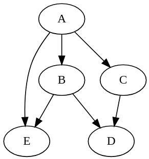

# Cpp-Taskflow

[](https://travis-ci.org/twhuang-uiuc/cpp-taskflow)
[![Gitter chat][Gitter badge]][Gitter]
[](./LICENSE)

A fast C++ header-only library to help you quickly build parallel programs with complex task dependencies.

# Why Cpp-Taskflow?

Cpp-Taskflow lets you quickly build parallel dependency graphs using modern C++17.
It is by far faster, more expressive, and easier for drop-in integration than existing libraries such as [OpenMP Tasking][OpenMP Tasking] and 
[TBB FlowGraph][TBB FlowGraph].


# Get Started with Cpp-Taskflow

The following example [simple.cpp](./example/simple.cpp) shows the basic API you need to use Cpp-Taskflow.

```cpp
#include "taskflow.hpp"  // the only include you need

int main(){
  
  tf::Taskflow tf(std::thread::hardware_concurrency());

  auto [A, B, C, D] = tf.silent_emplace(
    [] () { std::cout << "TaskA\n"; },               //  the taskflow graph
    [] () { std::cout << "TaskB\n"; },               // 
    [] () { std::cout << "TaskC\n"; },               //          +---+          
    [] () { std::cout << "TaskD\n"; }                //    +---->| B |-----+   
  );                                                 //    |     +---+     |
                                                     //  +---+           +-v-+ 
  A.precede(B);  // B runs after A                   //  | A |           | D | 
  A.precede(C);  // C runs after A                   //  +---+           +-^-+ 
  B.precede(D);  // D runs after B                   //    |     +---+     |    
  C.precede(D);  // C runs after D                   //    +---->| C |-----+    
                                                     //          +---+          
  tf.wait_for_all();  // block until finished

  return 0;
}

```
Compile and run the code with the following commands:
```bash
~$ g++ simple.cpp -std=c++1z -O2 -lpthread -o simple
~$ ./simple
TaskA
TaskC  <-- concurrent with TaskB
TaskB  <-- concurrent with TaskC
TaskD
```

# Create a Taskflow Graph
Cpp-Taskflow has very expressive and neat methods to create dependency graphs.
Most applications are developed through the following three steps.

## Step 1: Create a Task
To start a task dependency graph, 
create a taskflow object and specify the number of working threads.
```cpp
tf::Taskflow tf(std::max(1u, std::thread::hardware_concurrency()));
```
Create a task via the method `emplace` and get a pair of `Task` and `future`.
```cpp
auto [A, F] = tf.emplace([](){ std::cout << "Task A\n"; return 1; });
```
If you don't need a `future` to retrieve the result, use the method `silent_emplace` instead.
```cpp
auto A = tf.silent_emplace([](){ std::cout << "Task A\n"; });
```
Both methods implement variadic templates and can take arbitrary numbers of callables to create multiple tasks at one time.
```cpp
auto [A, B, C, D] = tf.silent_emplace(
  [] () { std::cout << "Task A\n"; },
  [] () { std::cout << "Task B\n"; },
  [] () { std::cout << "Task C\n"; },
  [] () { std::cout << "Task D\n"; }
);
```

## Step 2: Define Task Dependencies
Once tasks are created in the pool, you need to specify task dependencies in a 
[Directed Acyclic Graph (DAG)](https://en.wikipedia.org/wiki/Directed_acyclic_graph) fashion.
The handle `Task` supports different methods for you to describe task dependencies.

**Precede**: Adding a preceding link forces one task to run ahead of one another.
```cpp
A.precede(B);  // A runs before B.
```

**Broadcast**: Adding a broadcast link forces one task to run ahead of other(s).
```cpp
A.broadcast(B, C, D);  // A runs before B, C, and D.
```

**Gather**: Adding a gathering link forces one task to run after other(s).
```cpp
A.gather(B, C, D);  // A runs after B, C, and D.
```

**Linearize**: Linearizing a task sequence adds a  preceding link to each adjacent pair.
```cpp
tf.linearize(A, B, C, D);  // A runs before A, B runs before C, and C runs before D.
```

## Step 3: Execute the Tasks
There are three methods to carry out a task dependency graph, `dispatch`, `silent_dispatch`, and `wait_for_all`.

```cpp
auto future = tf.dispatch();  // non-blocking, returns with a future immediately.
tf.silent_dispatch();                // non-blocking, no return
```
Calling `wait_for_all` will block until all tasks complete.
```cpp
tf.wait_for_all();
```

# Debug a Taskflow Graph
Concurrent programs are notoriously difficult to debug. 
We suggest (1) naming tasks and dumping the graph, and (2) starting with single thread before going multiple.
Currently, Cpp-Taskflow supports [GraphViz][GraphViz] format.

```cpp
// debug.cpp
tf::Taskflow tf(0);  // force the master thread to execute all tasks
auto A = tf.silent_emplace([] () { /* ... */ }).name("A");
auto B = tf.silent_emplace([] () { /* ... */ }).name("B");
auto C = tf.silent_emplace([] () { /* ... */ }).name("C");
auto D = tf.silent_emplace([] () { /* ... */ }).name("D");
auto E = tf.silent_emplace([] () { /* ... */ }).name("E");

A.broadcast(B, C, E); 
C.precede(D);
B.broadcast(D, E); 

std::cout << tf.dump();
```
Run the program and inspect whether dependencies are expressed in the right way.
```bash
~$ ./debug
digraph Taskflow {
  "A" -> "B"
  "A" -> "C"
  "A" -> "E"
  "B" -> "D"
  "B" -> "E"
  "C" -> "D"
}
```
There are a number of free [GraphViz tools][AwesomeGraphViz] you could find online
to visualize your Taskflow graph.
 Taskflow with five tasks and six dependencies, generated by [Viz.js](http://viz-js.com/).

# API Reference

## Taskflow

The class `tf::Taskflow` is the main place to create taskflow graphs and carry out task dependencies.
The table below summarizes its commonly used methods.

| Method   | Argument  | Return  | Description |
| -------- | --------- | ------- | ----------- |
| Taskflow | none      | none    | construct a taskflow with the worker count equal to max hardware concurrency |
| Taskflow | size      | none    | construct a taskflow with a given number of workers |
| emplace  | callables | tasks, futures | insert nodes to execute the given callables; results can be retrieved from the returned futures |
| silent_emplace  | callables | tasks         | insert nodes to execute the given callables |
| placeholder     | none        | task         | insert a node without any work; work can be assigned later |
| linearize       | task list   | none         | create a linear dependency in the given task list |
| parallel_for    | beg, end, callable, group | task pair | apply the callable in parallel and group-by-group to the result of dereferencing every iterator in the range | 
| parallel_for    | container, callable, group | task pair | apply the callable in parallel and group-by-group to each element in the container | 
| dispatch        | none        | future | dispatch the current graph and return a shared future to block on completeness |
| silent_dispatch | none        | none | dispatch the current graph | 
| wait_for_all    | none        | none | dispatch the current graph and block until all graphs including previously dispatched ones finish |
| num_nodes       | none        | size | return the number of nodes in the current graph |  
| num_workers     | none        | size | return the number of working threads in the pool |  
| num_topologies  | none        | size | return the number of dispatched graphs |
| dump            | none        | string | dump the current graph to a string of GraphViz format |

## Task

Each `tf::Taskflow::Task` object is a lightweight handle for you to create dependencies in its associated graph. 
The table below summarizes its methods.

| Method         | Argument    | Return | Description |
| -------------- | ----------- | ------ | ----------- |
| name           | string      | self   | assign a human-readable name to the task |
| work           | callable    | self   | assign a work of a callable object to the task |
| precede        | task        | self   | enable this task to run *before* the given task |
| broadcast      | task list   | self   | enable this task to run *before* the given tasks |
| gather         | task list   | self   | enable this task to run *after* the given tasks |
| num_dependents | none        | size   | return the number of dependents (inputs) of this task |
| num_successors | none        | size   | return the number of successors (outputs) of this task |

# Caveats
While Cpp-Taskflow enables the expression of very complex task dependency graph that might contain 
thousands of task nodes and links, there are a few amateur pitfalls and mistakes to be aware of.

+ Having a cycle in a graph may result in running forever.
+ Trying to modify a dispatched task can result in undefined behavior.
+ Touching a taskflow from multiple threads are not safe.

Cpp-Taskflow is known to work on most Linux distributions and OSX.
Please [let me know][email me] if you found any issues in a particular platform.

# System Requirements
To use Cpp-Taskflow, you only need a C++17 compiler:
+ GNU C++ Compiler G++ v7.2 with -std=c++1z
+ Clang 5.0 C++ Compiler with -std=c++17

# Compile Unit Tests and Examples
Cpp-Taskflow uses [CMake](https://cmake.org/) to build examples and unit tests.
We recommend using out-of-source build.
```bash
~$ cmake --version  # must be at least 3.9 or higher
~$ mkdir build
~$ cd build
~$ cmake ../
~$ make 
```
## Unit Tests
Cpp-Taskflow uses [Doctest](https://github.com/onqtam/doctest) for unit tests.
```bash
~$ ./unittest/taskflow
```

Alternatively, you can use CMake's testing framework to run the unittest.
```bash
~$ cd build
~$ make test
```

## Examples
The folder `example/` contains several examples and is a great place to learn to use Cpp-Taskflow.

| Example |  Description |
| ------- |  ----------- | 
| [simple.cpp](./example/simple.cpp) | use basic task building blocks to create a trivial taskflow  graph |
| [matrix.cpp](./example/matrix.cpp) | create two set of matrices and multiply each individually in parallel |
| [parallel_for.cpp](./example/parallel_for.cpp)| parallelize a for loop with unbalanced workload |

# Get Involved
+ Report bugs/issues by submitting a [Github issue][Github issues].
+ Submit contributions using [pull requests][Github pull requests].
+ Live chat and ask questions on [Gitter][Gitter].

# Contributors
Cpp-Taskflow is being actively developed and contributed by the following people:
- [Tsung-Wei Huang][Tsung-Wei Huang] created the Cpp-Taskflow project and implemented the core routines.
- [Chun-Xun Lin][Chun-Xun Lin] co-created the Cpp-Taskflow project and implemented the core routines.
- [Martin Wong][Martin Wong] supported the Cpp-Taskflow project through NSF and DARPA funding.
- [Nan Xiao](https://github.com/NanXiao) fixed compilation error of unittest on the Arch platform.


See also the list of [contributors](./CONTRIBUTORS.txt) who participated in this project. 
Please [let me know][email me] if I forgot someone!

# Who is Using Cpp-Taskflow?

Cpp-Taskflow is being used in both industry and academic projects to scale up existing workloads that incorporate complex task dependencies. 
A proprietary research report has shown over 10x improvement by switching to Cpp-Taskflow.

- [OpenTimer][OpenTimer]: A High-performance Timing Analysis Tool for VLSI Systems.
- [DtCraft][DtCraft]: A General-purpose Distributed Programming Systems.

Please [let me know][email me] if I forgot your project!

# License


Cpp-Taskflow is licensed under the [MIT License](./LICENSE):

Copyright &copy; 2018 [Tsung-Wei Huang][Tsung-Wei Huang], [Chun-Xun Lin][Chun-Xun Lin], [Martin Wong][Martin Wong].

Permission is hereby granted, free of charge, to any person obtaining a copy of this software and associated documentation files (the “Software”), to deal in the Software without restriction, including without limitation the rights to use, copy, modify, merge, publish, distribute, sublicense, and/or sell copies of the Software, and to permit persons to whom the Software is furnished to do so, subject to the following conditions:

The above copyright notice and this permission notice shall be included in all copies or substantial portions of the Software.

THE SOFTWARE IS PROVIDED “AS IS”, WITHOUT WARRANTY OF ANY KIND, EXPRESS OR IMPLIED, INCLUDING BUT NOT LIMITED TO THE WARRANTIES OF MERCHANTABILITY, FITNESS FOR A PARTICULAR PURPOSE AND NONINFRINGEMENT. IN NO EVENT SHALL THE AUTHORS OR COPYRIGHT HOLDERS BE LIABLE FOR ANY CLAIM, DAMAGES OR OTHER LIABILITY, WHETHER IN AN ACTION OF CONTRACT, TORT OR OTHERWISE, ARISING FROM, OUT OF OR IN CONNECTION WITH THE SOFTWARE OR THE USE OR OTHER DEALINGS IN THE SOFTWARE.

* * *

[Tsung-Wei Huang]:       http://web.engr.illinois.edu/~thuang19/
[Chun-Xun Lin]:          https://github.com/clin99
[Martin Wong]:           https://ece.illinois.edu/directory/profile/mdfwong
[Gitter]:                https://gitter.im/cpp-taskflow/Lobby
[Gitter badge]:          ./image/gitter_badge.svg
[Github releases]:       https://github.com/twhuang-uiuc/cpp-taskflow/releases
[Github issues]:         https://github.com/twhuang-uiuc/cpp-taskflow/issues
[Github pull requests]:  https://github.com/twhuang-uiuc/cpp-taskflow/pulls
[GraphViz]:              https://www.graphviz.org/
[AwesomeGraphViz]:       https://github.com/CodeFreezr/awesome-graphviz
[OpenMP Tasking]:        http://www.nersc.gov/users/software/programming-models/openmp/openmp-tasking/
[TBB FlowGraph]:         https://www.threadingbuildingblocks.org/tutorial-intel-tbb-flow-graph
[OpenTimer]:             https://web.engr.illinois.edu/~thuang19/software/timer/OpenTimer.html
[DtCraft]:               http://dtcraft.web.engr.illinois.edu/
[email me]:              mailto:twh760812@gmail.com
