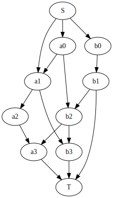
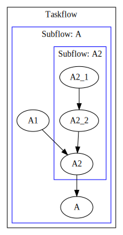
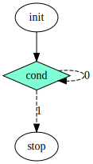
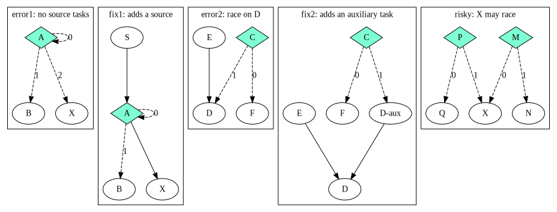
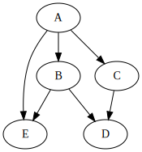
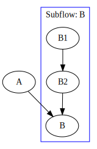

# Cpp-Taskflow 

[](https://app.codacy.com/app/tsung-wei-huang/cpp-taskflow?utm_source=github.com&utm_medium=referral&utm_content=cpp-taskflow/cpp-taskflow&utm_campaign=Badge_Grade_Dashboard)
[](https://travis-ci.com/cpp-taskflow/cpp-taskflow)
[](https://ci.appveyor.com/project/TsungWeiHuang/cpp-taskflow)
[](#system-requirements)
[][wiki]
[](doxygen/reference/ipdps19.pdf)

A fast C++ *header-only* library to help you quickly write parallel programs with complex task dependencies

# Why Cpp-Taskflow?

Cpp-Taskflow is by far faster, more expressive, and easier for drop-in integration
than existing parallel task programming libraries such as [OpenMP Tasking][OpenMP Tasking] 
and Intel [TBB FlowGraph][TBB FlowGraph] in handling complex parallel workloads.


Cpp-Taskflow lets you quickly implement task decomposition strategies
that incorporate both regular and irregular compute patterns,
together with an efficient *work-stealing* scheduler to optimize your multithreaded performance.

| Without Cpp-Taskflow | With Cpp-Taskflow |
| -------------------- | ----------------- |
|  |  |

Cpp-Taskflow has a unified interface for both *static* tasking and *dynamic* tasking,
allowing users to quickly master our parallel task programming model in a natural idiom.

| [Static Tasking](#get-started-with-cpp-taskflow) | [Dynamic Tasking](#dynamic-tasking) |
| :------------: | :-------------: |
|  |  |

Cpp-Taskflow supports conditional tasking for you to implement cyclic and dynamic control flows that are otherwise difficult to do with existing task programming frameworks.

| [Conditional Tasking](#conditional-tasking) |
| :-----------------: |
|  |

Cpp-Taskflow is composable. You can create large parallel graphs through
composition of modular and reusable blocks that are easier to optimize.

| [Graph Composition](#taskflow-composition) |
| :---------------: |
||

Cpp-Taskflow let you easily monitor the thread activities and analyze their programs' performance through [chrome://tracing][ChromeTracing].


We are committed to support trustworthy developments for both academic and industrial research projects in parallel computing. Check out [Who is Using Cpp-Taskflow](#who-is-using-cpp-taskflow) and what our users say:

+ *"Cpp-Taskflow is the cleanest Task API I've ever seen." [damienhocking][damienhocking]*
+ *"Cpp-Taskflow has a very simple and elegant tasking interface. The performance also scales very well." [totalgee][totalgee]*
+ *"Cpp-Taskflow lets me handle parallel processing in a smart way." [Hayabusa](https://cpp-learning.com/cpp-taskflow/)*
+ *"Best poster award for open-source parallel programming library." [Cpp Conference 2018][Cpp Conference 2018]*
+ *"Second Prize of Open-source Software Competition." [ACM Multimedia Conference 2019](https://tsung-wei-huang.github.io/img/mm19-ossc-award.jpg)*

See a quick [presentation][Presentation] and 
visit the [documentation][wiki] to learn more about Cpp-Taskflow.
Technical details can be referred to our [IEEE IPDPS19 paper][IPDPS19].

# Table of Contents

* [Get Started with Cpp-Taskflow](#get-started-with-cpp-taskflow)
* [Create a Taskflow Application](#create-a-taskflow-application)
   * [Step 1: Create a Taskflow](#step-1-create-a-taskflow)
   * [Step 2: Define Task Dependencies](#step-2-define-task-dependencies)
   * [Step 3: Execute a Taskflow](#step-3-execute-a-taskflow)
* [Dynamic Tasking](#dynamic-tasking)
   * [Step 1: Create a Subflow](#step-1-create-a-subflow)
   * [Step 2: Detach or Join a Subflow](#step-2-detach-or-join-a-subflow)
* [Conditional Tasking](#conditional-tasking)
   * [Step 1: Create a Condition Task](#step-1-create-a-condition-task)
   * [Step 2: Scheduling Rules for Condition Tasks](#step-2-scheduling-rules-for-condition-tasks)
* [Taskflow Composition](#taskflow-composition)
* [Visualize a Taskflow Graph](#visualize-a-taskflow-graph)
* [Monitor Thread Activities](#monitor-thread-activities)
* [API Reference](#api-reference)
* [System Requirements](#system-requirements)
* [Compile Unit Tests and Examples](#compile-unit-tests-and-examples)
* [Get Involved](#get-involved)
* [Who is Using Cpp-Taskflow?](#who-is-using-cpp-taskflow)


# Get Started with Cpp-Taskflow

The following example [simple.cpp](./example/simple.cpp) shows the basic Cpp-Taskflow API
you need in most applications.

```cpp
#include <taskflow/taskflow.hpp>  // Cpp-Taskflow is header-only

int main(){
  
  tf::Executor executor;
  tf::Taskflow taskflow;

  auto [A, B, C, D] = taskflow.emplace(
    [] () { std::cout << "TaskA\n"; },               //  task dependency graph
    [] () { std::cout << "TaskB\n"; },               // 
    [] () { std::cout << "TaskC\n"; },               //          +---+          
    [] () { std::cout << "TaskD\n"; }                //    +---->| B |-----+   
  );                                                 //    |     +---+     |
                                                     //  +---+           +-v-+ 
  A.precede(B);  // A runs before B                  //  | A |           | D | 
  A.precede(C);  // A runs before C                  //  +---+           +-^-+ 
  B.precede(D);  // B runs before D                  //    |     +---+     |    
  C.precede(D);  // C runs before D                  //    +---->| C |-----+    
                                                     //          +---+          
  executor.run(taskflow).wait();

  return 0;
}
```

Compile and run the code with the following commands:

```bash
~$ g++ simple.cpp -std=c++1z -O2 -lpthread -o simple
~$ ./simple
TaskA
TaskC  <-- concurrent with TaskB
TaskB  <-- concurrent with TaskC
TaskD
```

It is clear now Cpp-Taskflow is powerful in parallelizing tasks with complex dependencies.
The following example demonstrates a concurrent execution of 10 tasks with 15 dependencies.
With Cpp-Taskflow, you only need ***15 lines of code***.



```cpp
// source dependencies
S.precede(a0);    // S runs before a0
S.precede(b0);    // S runs before b0
S.precede(a1);    // S runs before a1

// a_ -> others
a0.precede(a1);   // a0 runs before a1
a0.precede(b2);   // a0 runs before b2
a1.precede(a2);   // a1 runs before a2
a1.precede(b3);   // a1 runs before b3
a2.precede(a3);   // a2 runs before a3

// b_ -> others
b0.precede(b1);   // b0 runs before b1
b1.precede(b2);   // b1 runs before b2
b2.precede(b3);   // b2 runs before b3
b2.precede(a3);   // b2 runs before a3

// target dependencies
a3.precede(T);    // a3 runs before T
b1.precede(T);    // b1 runs before T
b3.precede(T);    // b3 runs before T
```

# Create a Taskflow Application

Cpp-Taskflow defines a very expressive API to create task dependency graphs.
Most applications are developed through the following three steps.

## Step 1: Create a Taskflow

Create a taskflow object to build a task dependency graph:

```cpp
tf::Taskflow taskflow;
```

A task is a callable object for which [std::invoke][std::invoke] is applicable.
Use the method `emplace` to create a task:

```cpp
tf::Task A = taskflow.emplace([](){ std::cout << "Task A\n"; });
```

You can create multiple tasks at one time:

```cpp
auto [A, B, C, D] = taskflow.emplace(
  [] () { std::cout << "Task A\n"; },
  [] () { std::cout << "Task B\n"; },
  [] () { std::cout << "Task C\n"; },
  [] () { std::cout << "Task D\n"; }
);
```

## Step 2: Define Task Dependencies

You can add dependency links between tasks to enforce one task to run before or 
after another.

```cpp
A.precede(B);  // A runs before B.
```

## Step 3: Execute a Taskflow

To execute a taskflow, you need to create an *executor*.
An executor manages a set of worker threads to execute a taskflow
through an efficient *work-stealing* algorithm.

```cpp
tf::Executor executor;
```

The executor provides a rich set of methods to run a taskflow. 
You can run a taskflow multiple times, or until a stopping criteria is met.
These methods are non-blocking with a [std::future][std::future] return
to let you query the execution status.
Executor is *thread-safe*.

```cpp 
executor.run(taskflow);       // runs the taskflow once
executor.run_n(taskflow, 4);  // runs the taskflow four times

// keeps running the taskflow until the predicate becomes true
executor.run_until(taskflow, [counter=4](){ return --counter == 0; } );
```


You can call `wait_for_all` to block the executor until all associated taskflows complete.

```cpp
executor.wait_for_all();  // block until all associated tasks finish
```

Notice that the executor does not own any taskflow. 
It is your responsibility to keep a taskflow alive during its execution,
or it can result in undefined behavior.
In most applications, you need only one executor to run multiple taskflows
each representing a specific part of your parallel decomposition.

<div align="right"><b><a href="#table-of-contents">back to TOC</a></b></div>

# Dynamic Tasking 

Another powerful feature of Taskflow is *dynamic* tasking.
Dynamic tasks are those tasks created during the execution of a taskflow.
These tasks are spawned by a parent task and are grouped together to a *subflow* graph.
The example below demonstrates how to create a subflow
that spawns three tasks at runtime.


```cpp
// create three regular tasks
tf::Task A = tf.emplace([](){}).name("A");
tf::Task C = tf.emplace([](){}).name("C");
tf::Task D = tf.emplace([](){}).name("D");

// create a subflow graph (dynamic tasking)
tf::Task B = tf.emplace([] (tf::Subflow& subflow) {
  tf::Task B1 = subflow.emplace([](){}).name("B1");
  tf::Task B2 = subflow.emplace([](){}).name("B2");
  tf::Task B3 = subflow.emplace([](){}).name("B3");
  B1.precede(B3);
  B2.precede(B3);
}).name("B");
            
A.precede(B);  // B runs after A 
A.precede(C);  // C runs after A 
B.precede(D);  // D runs after B 
C.precede(D);  // D runs after C 
```

By default, a subflow graph joins its parent node. 
This ensures a subflow graph finishes before the successors of 
its parent task.
You can disable this feature by calling `subflow.detach()`.
For example, detaching the above subflow will result in the following execution flow:


```cpp
// create a "detached" subflow graph (dynamic tasking)
tf::Task B = tf.emplace([] (tf::Subflow& subflow) {
  tf::Task B1 = subflow.emplace([](){}).name("B1");
  tf::Task B2 = subflow.emplace([](){}).name("B2");
  tf::Task B3 = subflow.emplace([](){}).name("B3");
  B1.precede(B3);
  B2.precede(B3);

  // detach this subflow from task B
  subflow.detach();
}).name("B");
```

## Step 1: Create a Subflow

Cpp-Taskflow has an unified interface for static and dynamic tasking.
To create a subflow for dynamic tasking, 
emplace a callable with one argument of type `tf::Subflow`.

```cpp
tf::Task A = tf.emplace([] (tf::Subflow& subflow) {});
```

A subflow is a lightweight object that allows you to create 
arbitrary dependency graphs at runtime.
All graph building methods defined in taskflow
can be used in the subflow.

```cpp
tf::Task A = tf.emplace([] (tf::Subflow& subflow) {
  std::cout << "Task A is spawning two subtasks A1 and A2" << '\n';
  auto [A1, A2] = subflow.emplace(
    [] () { std::cout << "subtask A1" << '\n'; },
    [] () { std::cout << "subtask A2" << '\n'; }
    A1.precede(A2);
  );
});
```

A subflow can be nested or recursive. You can create another subflow from
the execution of a subflow and so on.



```cpp
tf::Task A = tf.emplace([] (tf::Subflow& sbf) {
  std::cout << "A spawns A1 & subflow A2\n";
  tf::Task A1 = sbf.emplace([] () { 
    std::cout << "subtask A1\n"; 
  }).name("A1");

  tf::Task A2 = sbf.emplace([] (tf::Subflow& sbf2) {
    std::cout << "A2 spawns A2_1 & A2_2\n";
    tf::Task A2_1 = sbf2.emplace([] () { 
      std::cout << "subtask A2_1\n"; 
    }).name("A2_1");
    tf::Task A2_2 = sbf2.emplace([] () { 
      std::cout << "subtask A2_2\n"; 
    }).name("A2_2");
    A2_1.precede(A2_2);
  }).name("A2");

  A1.precede(A2);
}).name("A");
```

## Step 2: Detach or Join a Subflow

A subflow will run after leaving the execution context of its parent task.
By default, a subflow joins its parent task.
Depending on applications, you can detach a subflow to enable more parallelism.

```cpp
tf::Task A = tf.emplace([] (tf::Subflow& subflow) {
  subflow.detach();  // detach this subflow from its parent task A
});  // subflow starts to run after the callable scope
```

Detaching or joining a subflow has different meaning in the completion status of 
its parent node.
In a joined subflow, 
the completion of its parent node is defined as when tasks
of the subflow and nested ones all finish.


```cpp
int value {0};

// create a joined subflow
tf::Task A = tf.emplace([&] (tf::Subflow& subflow) {
  subflow.emplace([&]() { 
    value = 10; 
  }).name("A1");
}).name("A");

// create a task B after A
tf::Task B = tf.emplace([&](){ assert(value == 10); }).name("B");

A.precede(B); // A1 finishes before A and therefore before B
```

When a subflow is detached from its parent task, it becomes a parallel
execution line to the current flow graph and will eventually
join the same taskflow.


```cpp
int value {0};

// create a detached subflow
tf::Task A = tf.emplace([&] (tf::Subflow& subflow) {
  subflow.emplace([&]() { value = 10; }).name("A1");
  subflow.detach();
}).name("A");

// create a task B after A
tf::Task B = tf.emplace([&] () { /* value may not be 10 */ }).name("B");

A.precede(B);
```

<div align="right"><b><a href="#table-of-contents">back to TOC</a></b></div>

# Conditional Tasking

Taskflow supports *conditional tasking* for users to implement *dynamic* and *cyclic* control flows.
You can create highly versatile and efficient parallel patterns through condition tasks.

## Step 1: Create a Condition Task

A *condition task* evalutes a set of instructions and returns an integer index
of the next immediate successor to execute.
The index is defined with respect to the order of its successor construction.



```cpp
tf::Task init = tf.emplace([](){ }).name("init");
tf::Task stop = tf.emplace([](){ }).name("stop");

// creates a condition task that returns 0 or 1
tf::Task cond = tf.emplace([](){
  std::cout << "flipping a coin\n";
  return rand() % 2;
}).name("cond");

// creates a feedback loop
init.precede(cond);
cond.precede(cond, stop);  // cond--0-->cond, cond--1-->stop

executor.run(tf).wait();
```

If the return value from `cond` is 0, it loops back to itself, or otherwise to `stop`.
Cpp-Taskflow terms the preceding link from a condition task a *weak dependency*
(dashed lines above).
Others are *strong depedency* (solid lines above).


## Step 2: Scheduling Rules for Condition Tasks

When you submit a taskflow to an executor,
the scheduler starts with tasks of *zero dependency* (both weak and strong dependencies)
and continues to execute successive tasks whenever *strong dependencies* are met.
However, 
the scheduler skips this rule for a condition task and jumps directly to its successor
indexed by the return value.


It is users' responsibility to ensure a taskflow is properly conditioned. 
Top things to avoid include no source tasks to start with and task race.
The figure shows common pitfalls and their remedies.
In the risky scenario, task X may not be raced if P and M is exclusively
branching to X.




A good practice for avoiding mistakes of conditional tasking is to infer the execution flow of your graphs based on our scheduling rules.
Make sure there is no task race.

<div align="right"><b><a href="#table-of-contents">back to TOC</a></b></div>


# Taskflow Composition

A powerful feature of `tf::Taskflow` is composability. 
You can create multiple task graphs from different parts of your workload
and use them to compose a large graph through the `composed_of` method. 


```cpp 
tf::Taskflow f1, f2;

auto [f1A, f1B] = f1.emplace( 
  []() { std::cout << "Task f1A\n"; },
  []() { std::cout << "Task f1B\n"; }
);
auto [f2A, f2B, f2C] = f2.emplace( 
  []() { std::cout << "Task f2A\n"; },
  []() { std::cout << "Task f2B\n"; },
  []() { std::cout << "Task f2C\n"; }
);
auto f1_module_task = f2.composed_of(f1);

f2A.precede(f1_module_task);
f2B.precede(f1_module_task);
f1_module_task.precede(f2C);
```

Similarly, `composed_of` returns a task handle and you can use 
`precede` to create dependencies. 
You can compose a taskflow from multiple taskflows and use the result
to compose a larger taskflow and so on.

<div align="right"><b><a href="#table-of-contents">back to TOC</a></b></div>

# Visualize a Taskflow Graph

You can dump a taskflow in [GraphViz][GraphViz] format using the method `dump`.

```cpp
tf::Taskflow taskflow;

tf::Task A = taskflow.emplace([] () {}).name("A");
tf::Task B = taskflow.emplace([] () {}).name("B");
tf::Task C = taskflow.emplace([] () {}).name("C");
tf::Task D = taskflow.emplace([] () {}).name("D");
tf::Task E = taskflow.emplace([] () {}).name("E");

A.precede(B, C, E); 
C.precede(D);
B.precede(D, E); 

taskflow.dump(std::cout);
```

There are a number of free [GraphViz tools][AwesomeGraphViz] you could find online to visualize your Taskflow graph.



```bash
// Taskflow with five tasks and six dependencies
digraph Taskflow {
  rankdir="TB"
  "A" -> "B"
  "A" -> "C"
  "A" -> "E"
  "B" -> "D"
  "B" -> "E"
  "C" -> "D"
}
```

When you have dynamic tasks (subflows),
you cannot simply use the `dump` method because it displays only the static portion.
Instead, you need to execute the graph first to spawn dynamic tasks.



```cpp
tf::Executor executor;
tf::Taskflow taskflow;

tf::Task A = taskflow.emplace([](){}).name("A");

// create a subflow of two tasks B1->B2
tf::Task B = taskflow.emplace([] (tf::Subflow& subflow) {
  tf::Task B1 = subflow.emplace([](){}).name("B1");
  tf::Task B2 = subflow.emplace([](){}).name("B2");
  B1.precede(B2);
}).name("B");

A.precede(B);

executor.run(tf).wait();  // run the taskflow to spawn subflows
tf.dump(std::cout);       // dump the graph including dynamic tasks
```

<div align="right"><b><a href="#table-of-contents">back to TOC</a></b></div>

# Monitor Thread Activities 

Understanding thread activities is very important for performance analysis. 
Cpp-Taskflow provides a default *observer* of type `tf::ExecutorObserver` 
that lets users observe when a thread starts or stops participating in task scheduling.

```cpp 
auto observer = executor.make_observer<tf::ExecutorObserver>();
```

When you are running a task dependency graph,
the observer will automatically record the start and end timestamps of each executed task.
You can dump the entire execution timelines into a JSON file.

```cpp 
executor.run(taskflow1);               // run a task dependency graph 1
executor.run(taskflow2);               // run a task dependency graph 2
executor.wait_for_all();               // block until all tasks finish

std::ofstream ofs("timestamps.json");
observer->dump(ofs);                   // dump the timeline to a JSON file
```

You can open the chrome browser to visualize the execution timelines through the 
[chrome://tracing][ChromeTracing] developer tool. 
In the tracing view, click the `Load` button to read the JSON file. 
You shall see the tracing graph.


Each task is given a name of `i_j` where `i` is the thread id and `j` is the task number.
You can pan or zoom in/out the timeline to get into a detailed view.

<div align="right"><b><a href="#table-of-contents">back to TOC</a></b></div>

# API Reference

The official [documentation][wiki] explains a complete list of 
Cpp-Taskflow API. 
Here, we highlight commonly used methods.

## Taskflow API

The class `tf::Taskflow` is the main place to create a task dependency graph.
The table below summarizes a list of commonly used methods.

| Method   | Argument  | Return  | Description |
| -------- | --------- | ------- | ----------- |
| emplace  | callables | tasks   | creates a task with a given callable(s) |
| placeholder     | none        | task         | inserts a node without any work; work can be assigned later |
| parallel_for    | beg, end, callable, chunk | task pair | concurrently applies the callable chunk by chunk to the result of dereferencing every iterator in the range | 
| parallel_for    | beg, end, step, callable, chunk | task pair | concurrently applies the callable chunk by chunk to an index-based range with a step size | 
| num_workers     | none        | size | queries the number of working threads in the pool |  
| dump            | ostream     | none | dumps the taskflow to an output stream in GraphViz format |

### *emplace/placeholder*

You can use `emplace` to create a task from a target callable.

```cpp
tf::Task task = tf.emplace([] () { std::cout << "my task\n"; });
```

When a task cannot be determined beforehand, you can create a placeholder and assign the calalble later.

```cpp
tf::Task A = tf.emplace([](){});
tf::Task B = tf.placeholder();
A.precede(B);
B.work([](){ /* do something */ });
```

### *parallel_for*

The method `parallel_for` creates a subgraph that applies the callable to each item in the given range of a container.


```cpp
auto v = {'A', 'B', 'C', 'D'};
auto [S, T] = tf.parallel_for(
  v.begin(),    // iterator to the beginning
  v.end(),      // iterator to the end
  [] (int i) { 
    std::cout << "parallel " << i << '\n';
  }
);
// add dependencies via S and T.
```

You can specify a *chunk* size (default one) in the last argument to force a task to include a certain number of items.


```cpp
auto v = {'A', 'B', 'C', 'D'};
auto [S, T] = tf.parallel_for(
  v.begin(),    // iterator to the beginning
  v.end(),      // iterator to the end
  [] (int i) { 
    std::cout << "AB and CD run in parallel" << '\n';
  },
  2  // at least two items at a time
);
```

In addition to iterator-based construction, 
`parallel_for` has another overload of index-based loop.
The first three argument of this overload indicates 
starting index, ending index (exclusive), and step size.

```cpp
// [0, 11) with a step size of 2
auto [S, T] = tf.parallel_for(
  0, 11, 2, 
  [] (int i) {
    std::cout << "parallel_for on index " << i << std::endl;
  }, 
  2  // at least two items at a time
);
// will print 0, 2, 4, 6, 8, 10 (three partitions, {0, 2}, {4, 6}, {8, 10})
```

You can also do opposite direction with negative step size.

```cpp
// [10, -1) with a step size of -2
auto [S, T] = tf.parallel_for(
  10, -1, 2, 
  [] (int i) {
    std::cout << "parallel_for on index " << i << std::endl;
  }
);
// will print 10, 8, 6, 4, 2, 0
```

## Task API

Each time you create a task, the taskflow object adds a node to the present task dependency graph
and return a *task handle* to you.
A task handle is a lightweight object that defines a set of methods for users to
access and modify the attributes of the associated task.
The table below summarizes a list of commonly used methods.

| Method         | Argument    | Return | Description |
| -------------- | ----------- | ------ | ----------- |
| name           | string      | self   | assigns a human-readable name to the task |
| work           | callable    | self   | assigns a work of a callable object to the task |
| precede        | task list   | self   | enables this task to run *before* the given tasks |
| succeed        | task list   | self   | enables this task to run *after* the given tasks |
| num_dependents | none        | size   | returns the number of dependents (inputs) of this task |
| num_successors | none        | size   | returns the number of successors (outputs) of this task |
| empty          | none        | bool   | returns true if the task points to a graph node or false otherwise |
| has_work       | none        | bool   | returns true if the task points to a graph node with a callable assigned |

### *name*

The method `name` lets you assign a human-readable string to a task.

```cpp
A.name("my name is A");
```

### *work*

The method `work` lets you assign a callable to a task.

```cpp
A.work([] () { std::cout << "hello world!"; });
```

### *precede*

The method `precede` lets you add a preceding link from self to other tasks.


```cpp
// A runs before B, C, D, and E
A.precede(B, C, D, E);
```

### *succeed*

The method `succeed` lets you add a preceding link from other tasks to self.


```cpp
// A runs after B, C, D, and E
A.succeed(B, C, D, E);
```

### *empty/has_work*

A task is empty is it is not associated with any graphs.

```cpp
tf::Task task;  // assert(task.empty());
```

A placeholder task is associated with a graph node but has no work assigned yet.

```
tf::Task task = taskflow.placeholder();  // assert(!task.has_work());
```

## Executor API

The class `tf::Executor` is used for execution of one or multiple taskflow objects.
The table below summarizes a list of commonly used methods. 

| Method    | Argument       | Return        | Description              |
| --------- | -------------- | ------------- | ------------------------ |
| Executor  | N              | none          | constructs an executor with N worker threads |
| run       | taskflow       | future | runs the taskflow once    |
| run_n     | taskflow, N    | future | runs the taskflow N times |
| run_until | taskflow, binary predicate | future | keeps running the taskflow until the predicate becomes true |
| wait_for_all | none | none | blocks until all running tasks finish |
| make_observer | arguments to forward to user-derived constructor | pointer to the observer | creates an observer to monitor the thread activities of the executor |

### *Executor*

The constructor of tf::Executor takes an unsigned *non-zero* integer to 
initialize the executor with `N` worker threads.

```cpp
tf::Executor executor(8);  // create an executor of 8 worker threads
```

The default value uses `std::thread::hardware_concurrency` 
to decide the number of worker threads.

### *run/run_n/run_until*

The run series are non-blocking call to execute a taskflow graph.
Issuing multiple runs on the same taskflow will automatically synchronize 
to a sequential chain of executions.

```cpp
executor.run(taskflow);             // runs a graph once
executor.run_n(taskflow, 5);        // runs a graph five times
executor.run_n(taskflow, my_pred);  // keeps running until the my_pred becomes true
executor.wait_for_all();            // blocks until all tasks finish
```

The first run finishes before the second run, and the second run finishes before the third run.
 <div align="right"><b><a href="#table-of-contents">back to TOC</a></b></div>

# System Requirements

To use the latest [Cpp-Taskflow](https://github.com/cpp-taskflow/cpp-taskflow/archive/master.zip), you only need a [C++17][C++17] compiler:
+ GNU C++ Compiler v7.3 with -std=c++1z
+ Clang C++ Compiler v6.0 with -std=c++17
+ Microsoft Visual Studio Version 15.7 (MSVC++ 19.14)
+ Apple Clang Version 11.0

A C++14 compatible version is provided [here](https://github.com/cpp-taskflow/cpp-taskflow/archive/cpp14.zip), and you need a [C++14][C++14] compiler:
+ GNU C++ Compiler v4.9 with -std=c++1y
+ Clang C++ Compiler v5.0 with -std=c++14

<div align="right"><b><a href="#table-of-contents">back to TOC</a></b></div>


# Compile Unit Tests and Examples

Cpp-Taskflow uses [CMake](https://cmake.org/) to build examples and unit tests.
We recommend using out-of-source build.

```bash
~$ cmake --version  # must be at least 3.9 or higher
~$ mkdir build
~$ cd build
~$ cmake ../
~$ make 
```

## Unit Tests

Cpp-Taskflow uses [Doctest](https://github.com/onqtam/doctest) for unit tests.

```bash
~$ ./unittest/taskflow
```

Alternatively, you can use CMake's testing framework to run the unittest.

```bash
~$ cd build
~$ make test
```

## Examples

The folder `example/` contains several examples and is a great place to learn to use Cpp-Taskflow.

| Example |  Description |
| ------- |  ----------- | 
| [simple.cpp](./example/simple.cpp) | uses basic task building blocks to create a trivial taskflow  graph |
| [debug.cpp](./example/debug.cpp)| inspects a taskflow through the dump method |
| [parallel_for.cpp](./example/parallel_for.cpp)| parallelizes a for loop with unbalanced workload |
| [reduce.cpp](./example/reduce.cpp)| performs reduce operations over linear containers |
| [subflow.cpp](./example/subflow.cpp)| demonstrates how to create a subflow graph that spawns three dynamic tasks |
| [run_variants.cpp](./example/run_variants.cpp)| shows multiple ways to run a taskflow graph |
| [composition.cpp](./example/composition.cpp)| demonstrates the decomposable interface of taskflow |
| [observer.cpp](./example/observer.cpp)| demonstrates how to monitor the thread activities in scheduling and running tasks |
| [condition.cpp](./example/condition.cpp) | creates a conditional tasking graph with a feedback loop control flow |

<div align="right"><b><a href="#table-of-contents">back to TOC</a></b></div>

# Get Involved

+ Report bugs/issues by submitting a [GitHub issue][GitHub issues]
+ Submit contributions using [pull requests][GitHub pull requests]
+ Learn more about Cpp-Taskflow by reading the [documentation][wiki]
+ Release notes are highlighted [here][release notes]
+ Read and cite our [IPDPS19][IPDPS19] paper
+ Visit a curated list of [awesome parallel computing resources](https://github.com/tsung-wei-huang/awesome-parallel-computing)

<div align="right"><b><a href="#table-of-contents">back to TOC</a></b></div>

# Who is Using Cpp-Taskflow?

Cpp-Taskflow is being used in both industry and academic projects to scale up existing workloads 
that incorporate complex task dependencies. 

- [OpenTimer][OpenTimer]: A High-performance Timing Analysis Tool for Very Large Scale Integration (VLSI) Systems
- [DtCraft][DtCraft]: A General-purpose Distributed Programming Systems using Data-parallel Streams
- [Firestorm][Firestorm]: Fighting Game Engine with Asynchronous Resource Loaders (developed by [ForgeMistress][ForgeMistress])
- [Shiva][Shiva]: An extensible engine via an entity component system through scripts, DLLs, and header-only (C++)
- [PID Framework][PID Framework]: A Global Development Methodology Supported by a CMake API and Dedicated C++ Projects 
- [NovusCore][NovusCore]: An emulating project for World of Warcraft (Wrath of the Lich King 3.3.5a 12340 client build)
- [SA-PCB][SA-PCB]: Annealing-based Printed Circuit Board (PCB) Placement Tool
- [LPMP](https://github.com/LPMP/LPMP): A C++ framework for developing scalable Lagrangean decomposition solvers for discrete optimization problems
- [Heteroflow](https://github.com/Heteroflow/Heteroflow): A Modern C++ Parallel CPU-GPU Task Programming Library
- [OpenPhySyn](https://github.com/The-OpenROAD-Project/OpenPhySyn): A plugin-based physical synthesis optimization kit as part of the OpenRoad flow

[More...](https://github.com/search?q=cpp-taskflow&type=Code)

<div align="right"><b><a href="#table-of-contents">back to TOC</a></b></div>

# Contributors

Cpp-Taskflow is being actively developed and contributed by the 
[these people](https://github.com/cpp-taskflow/cpp-taskflow/graphs/contributors).
Meanwhile, we appreciate the support from many organizations for our developments.


| [][UofU] | [][UIUC] | [][CSL] | [][NSF] | [][DARPA IDEA] |
| :---: | :---: | :---: | :---: | :---: |


# License

Cpp-Taskflow is licensed under the [MIT License](./LICENSE).

* * *

[Tsung-Wei Huang]:       https://tsung-wei-huang.github.io/
[Chun-Xun Lin]:          https://github.com/clin99
[Martin Wong]:           https://ece.illinois.edu/directory/profile/mdfwong
[Andreas Olofsson]:      https://github.com/aolofsson
[Gitter]:                https://gitter.im/cpp-taskflow/Lobby
[Gitter badge]:          ./image/gitter_badge.svg
[GitHub releases]:       https://github.com/coo-taskflow/cpp-taskflow/releases
[GitHub issues]:         https://github.com/cpp-taskflow/cpp-taskflow/issues
[GitHub insights]:       https://github.com/cpp-taskflow/cpp-taskflow/pulse
[GitHub pull requests]:  https://github.com/cpp-taskflow/cpp-taskflow/pulls
[GitHub contributors]:   https://github.com/cpp-taskflow/cpp-taskflow/graphs/contributors
[GraphViz]:              https://www.graphviz.org/
[AwesomeGraphViz]:       https://github.com/CodeFreezr/awesome-graphviz
[OpenMP Tasking]:        https://www.openmp.org/spec-html/5.0/openmpsu99.html 
[TBB FlowGraph]:         https://www.threadingbuildingblocks.org/tutorial-intel-tbb-flow-graph
[OpenTimer]:             https://github.com/OpenTimer/OpenTimer
[DtCraft]:               https://github.com/tsung-wei-huang/DtCraft
[totalgee]:              https://github.com/totalgee
[damienhocking]:         https://github.com/damienhocking
[ForgeMistress]:         https://github.com/ForgeMistress
[Patrik Huber]:          https://github.com/patrikhuber
[DARPA IDEA]:            https://www.darpa.mil/news-events/2017-09-13
[KingDuckZ]:             https://github.com/KingDuckZ
[NSF]:                   https://www.nsf.gov/
[UIUC]:                  https://illinois.edu/
[CSL]:                   https://csl.illinois.edu/
[UofU]:                  https://www.utah.edu/
[wiki]:                  https://cpp-taskflow.github.io/cpp-taskflow/index.html
[release notes]:         https://cpp-taskflow.github.io/cpp-taskflow/Releases.html
[PayMe]:                 https://www.paypal.me/twhuang/10
[C++17]:                 https://en.wikipedia.org/wiki/C%2B%2B17
[C++14]:                 https://en.wikipedia.org/wiki/C%2B%2B14
[email me]:              mailto:twh760812@gmail.com
[Cpp Conference 2018]:   https://github.com/CppCon/CppCon2018
[ChromeTracing]:         https://www.chromium.org/developers/how-tos/trace-event-profiling-tool
[IPDPS19]:               https://tsung-wei-huang.github.io/papers/ipdps19.pdf
[WorkStealing Wiki]:     https://en.wikipedia.org/wiki/Work_stealing

[std::invoke]:           https://en.cppreference.com/w/cpp/utility/functional/invoke
[std::future]:           https://en.cppreference.com/w/cpp/thread/future

[Firestorm]:             https://github.com/ForgeMistress/Firestorm
[Shiva]:                 https://shiva.gitbook.io/project/shiva
[PID Framework]:         http://pid.lirmm.net/pid-framework/index.html
[NovusCore]:             https://github.com/novuscore/NovusCore
[SA-PCB]:                https://github.com/choltz95/SA-PCB

[Presentation]:          https://cpp-taskflow.github.io/
[chrome://tracing]:      chrome://tracing

