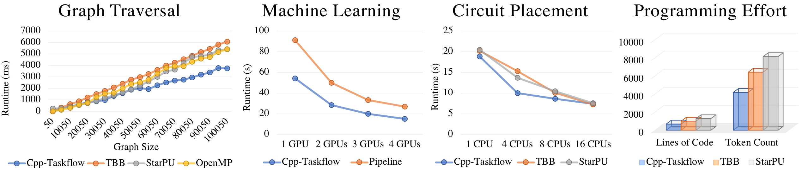
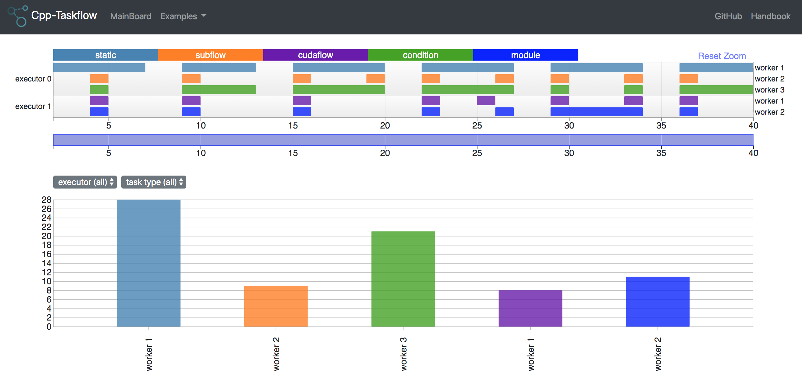
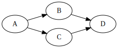
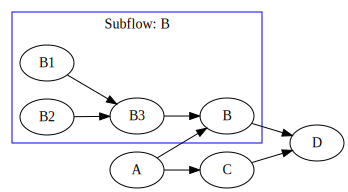
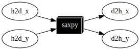
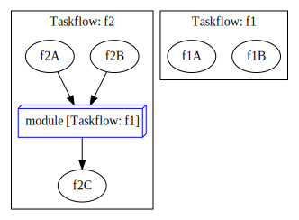

# Taskflow 

<!--[](https://travis-ci.com/taskflow/taskflow)-->
[](https://github.com/taskflow/taskflow/actions?query=workflow%3AUbuntu)
[](https://github.com/taskflow/taskflow/actions?query=workflow%3AmacOS)
[](https://github.com/taskflow/taskflow/actions?query=workflow%3AWindows)
[][documentation]
[](https://taskflow.github.io/tfprof/)
[][TPDS22]

Taskflow helps you quickly write parallel and heterogeneous task programs in modern C++

# Why Taskflow?

Taskflow is faster, more expressive, and easier for drop-in integration
than many of existing task programming frameworks
in handling complex parallel workloads.



Taskflow lets you quickly implement task decomposition strategies
that incorporate both regular and irregular compute patterns,
together with an efficient *work-stealing* scheduler to optimize your multithreaded performance.

| [Static Tasking](#start-your-first-taskflow-program) | [Subflow Tasking](#create-a-subflow-graph) |
| :------------: | :-------------: |
|  |  |

Taskflow supports conditional tasking for you to make rapid control-flow decisions
across dependent tasks to implement cycles and conditions that were otherwise difficult to do
with existing tools.

| [Conditional Tasking](#integrate-control-flow-to-a-task-graph) |
| :-----------------: |
|  |

Taskflow is composable. You can create large parallel graphs through
composition of modular and reusable blocks that are easier to optimize
at an individual scope.

| [Taskflow Composition](#compose-task-graphs) |
| :---------------: |
||

Taskflow supports heterogeneous tasking for you to
accelerate a wide range of scientific computing applications
by harnessing the power of CPU-GPU collaborative computing.

| [Concurrent CPU-GPU Tasking](#offload-a-task-to-a-gpu) |
| :-----------------: |
|  |


Taskflow provides visualization and tooling needed for profiling Taskflow programs.

| [Taskflow Profiler](https://taskflow.github.io/tfprof) |
| :-----------------: |
|  |

We are committed to support trustworthy developments for both academic and industrial research projects
in parallel computing. Check out [Who is Using Taskflow](https://taskflow.github.io/#tag_users) and what our users say:

+ *"Taskflow is the cleanest Task API I've ever seen." [Damien Hocking @Corelium Inc](http://coreliuminc.com)*
+ *"Taskflow has a very simple and elegant tasking interface. The performance also scales very well." [Glen Fraser][totalgee]*
+ *"Taskflow lets me handle parallel processing in a smart way." [Hayabusa @Learning](https://cpp-learning.com/cpp-taskflow/)*
+ *"Taskflow improves the throughput of our graph engine in just a few hours of coding." [Jean-Michaël @KDAB](https://ossia.io/)*
+ *"Best poster award for open-source parallel programming library." [Cpp Conference 2018][Cpp Conference 2018]*
+ *"Second Prize of Open-source Software Competition." [ACM Multimedia Conference 2019](https://tsung-wei-huang.github.io/img/mm19-ossc-award.jpg)*

See a quick [presentation](https://taskflow.github.io/) and
visit the [documentation][documentation] to learn more about Taskflow.
Technical details can be referred to our [IEEE TPDS paper][TPDS21].

# Start Your First Taskflow Program

The following program (`simple.cpp`) creates four tasks 
`A`, `B`, `C`, and `D`, where `A` runs before `B` and `C`, and `D`
runs after `B` and `C`.
When `A` finishes, `B` and `C` can run in parallel.
Try it live on [Compiler Explorer (godbolt)](https://godbolt.org/z/j8hx3xnnx)!


```cpp
#include <taskflow/taskflow.hpp>  // Taskflow is header-only

int main(){
  
  tf::Executor executor;
  tf::Taskflow taskflow;

  auto [A, B, C, D] = taskflow.emplace(  // create four tasks
    [] () { std::cout << "TaskA\n"; },
    [] () { std::cout << "TaskB\n"; },
    [] () { std::cout << "TaskC\n"; },
    [] () { std::cout << "TaskD\n"; } 
  );                                  
                                      
  A.precede(B, C);  // A runs before B and C
  D.succeed(B, C);  // D runs after  B and C
                                      
  executor.run(taskflow).wait(); 

  return 0;
}
```

Taskflow is *header-only* and there is no wrangle with installation.
To compile the program, clone the Taskflow project and 
tell the compiler to include the [headers](./taskflow/).

```bash
~$ git clone https://github.com/taskflow/taskflow.git  # clone it only once
~$ g++ -std=c++17 examples/simple.cpp -I. -O2 -pthread -o simple
~$ ./simple
TaskA
TaskC 
TaskB 
TaskD
```

# Visualize Your First Taskflow Program

Taskflow comes with a built-in profiler, 
[TFProf](https://taskflow.github.io/tfprof/), 
for you to profile and visualize taskflow programs
in an easy-to-use web-based interface.


```bash
# run the program with the environment variable TF_ENABLE_PROFILER enabled
~$ TF_ENABLE_PROFILER=simple.json ./simple
~$ cat simple.json
[
{"executor":"0","data":[{"worker":0,"level":0,"data":[{"span":[172,186],"name":"0_0","type":"static"},{"span":[187,189],"name":"0_1","type":"static"}]},{"worker":2,"level":0,"data":[{"span":[93,164],"name":"2_0","type":"static"},{"span":[170,179],"name":"2_1","type":"static"}]}]}
]
# paste the profiling json data to https://taskflow.github.io/tfprof/
```

In addition to execution diagram, you can dump the graph to a DOT format 
and visualize it using a number of free [GraphViz][GraphViz] tools.

```
// dump the taskflow graph to a DOT format through std::cout
taskflow.dump(std::cout); 
```

<p align="center"></p>

# Express Task Graph Parallelism

Taskflow empowers users with both static and dynamic task graph constructions
to express end-to-end parallelism in a task graph that
embeds in-graph control flow.

1. [Create a Subflow Graph](#create-a-subflow-graph)
2. [Integrate Control Flow to a Task Graph](#integrate-control-flow-to-a-task-graph)
3. [Offload a Task to a GPU](#offload-a-task-to-a-gpu)
4. [Compose Task Graphs](#compose-task-graphs)
5. [Launch Asynchronous Tasks](#launch-asynchronous-tasks)
6. [Execute a Taskflow](#execute-a-taskflow)
7. [Leverage Standard Parallel Algorithms](#leverage-standard-parallel-algorithms)

## Create a Subflow Graph

Taskflow supports *dynamic tasking* for you to create a subflow
graph from the execution of a task to perform dynamic parallelism.
The following program spawns a task dependency graph parented at task `B`.

```cpp
tf::Task A = taskflow.emplace([](){}).name("A");  
tf::Task C = taskflow.emplace([](){}).name("C");  
tf::Task D = taskflow.emplace([](){}).name("D");  

tf::Task B = taskflow.emplace([] (tf::Subflow& subflow) { 
  tf::Task B1 = subflow.emplace([](){}).name("B1");  
  tf::Task B2 = subflow.emplace([](){}).name("B2");  
  tf::Task B3 = subflow.emplace([](){}).name("B3");  
  B3.succeed(B1, B2);  // B3 runs after B1 and B2
}).name("B");

A.precede(B, C);  // A runs before B and C
D.succeed(B, C);  // D runs after  B and C
```

<p align="center"></p>

## Integrate Control Flow to a Task Graph 

Taskflow supports *conditional tasking* for you to make rapid 
control-flow decisions across dependent tasks to implement cycles 
and conditions in an *end-to-end* task graph.

```cpp
tf::Task init = taskflow.emplace([](){}).name("init");
tf::Task stop = taskflow.emplace([](){}).name("stop");

// creates a condition task that returns a random binary
tf::Task cond = taskflow.emplace(
  [](){ return std::rand() % 2; }
).name("cond");

init.precede(cond);

// creates a feedback loop {0: cond, 1: stop}
cond.precede(cond, stop);
```

<p align="center"></p>


## Offload a Task to a GPU

Taskflow supports GPU tasking for you to accelerate a wide range of scientific computing applications by harnessing the power of CPU-GPU collaborative computing using CUDA.

```cpp
__global__ void saxpy(size_t N, float alpha, float* dx, float* dy) {
  int i = blockIdx.x*blockDim.x + threadIdx.x;
  if (i < n) {
    y[i] = a*x[i] + y[i];
  }
}
tf::Task cudaflow = taskflow.emplace([&](tf::cudaFlow& cf) {

  // data copy tasks
  tf::cudaTask h2d_x = cf.copy(dx, hx.data(), N).name("h2d_x");
  tf::cudaTask h2d_y = cf.copy(dy, hy.data(), N).name("h2d_y");
  tf::cudaTask d2h_x = cf.copy(hx.data(), dx, N).name("d2h_x");
  tf::cudaTask d2h_y = cf.copy(hy.data(), dy, N).name("d2h_y");
  
  // kernel task with parameters to launch the saxpy kernel
  tf::cudaTask saxpy = cf.kernel(
    (N+255)/256, 256, 0, saxpy, N, 2.0f, dx, dy
  ).name("saxpy");

  saxpy.succeed(h2d_x, h2d_y)
       .precede(d2h_x, d2h_y);
}).name("cudaFlow");
```

<p align="center"></p>

## Compose Task Graphs

Taskflow is composable. 
You can create large parallel graphs through composition of modular 
and reusable blocks that are easier to optimize at an individual scope.

```cpp
tf::Taskflow f1, f2;

// create taskflow f1 of two tasks
tf::Task f1A = f1.emplace([]() { std::cout << "Task f1A\n"; })
                 .name("f1A");
tf::Task f1B = f1.emplace([]() { std::cout << "Task f1B\n"; })
                 .name("f1B");

// create taskflow f2 with one module task composed of f1
tf::Task f2A = f2.emplace([]() { std::cout << "Task f2A\n"; })
                 .name("f2A");
tf::Task f2B = f2.emplace([]() { std::cout << "Task f2B\n"; })
                 .name("f2B");
tf::Task f2C = f2.emplace([]() { std::cout << "Task f2C\n"; })
                 .name("f2C");

tf::Task f1_module_task = f2.composed_of(f1)
                            .name("module");

f1_module_task.succeed(f2A, f2B)
              .precede(f2C);
```

<p align="center"></p>

## Launch Asynchronous Tasks

Taskflow supports *asynchronous* tasking.
You can launch tasks asynchronously to dynamically explore task graph parallelism.

```cpp
tf::Executor executor;

// create asynchronous tasks directly from an executor
std::future<int> future = executor.async([](){ 
  std::cout << "async task returns 1\n";
  return 1;
}); 
executor.silent_async([](){ std::cout << "async task does not return\n"; });

// create asynchronous tasks with dynamic dependencies
tf::AsyncTask A = executor.silent_dependent_async([](){ printf("A\n"); });
tf::AsyncTask B = executor.silent_dependent_async([](){ printf("B\n"); }, A);
tf::AsyncTask C = executor.silent_dependent_async([](){ printf("C\n"); }, A);
tf::AsyncTask D = executor.silent_dependent_async([](){ printf("D\n"); }, B, C);

executor.wait_for_all();
```

## Execute a Taskflow

The executor provides several *thread-safe* methods to run a taskflow. 
You can run a taskflow once, multiple times, or until a stopping criteria is met. 
These methods are non-blocking with a `tf::Future<void>` return 
to let you query the execution status. 

```cpp
// runs the taskflow once
tf::Future<void> run_once = executor.run(taskflow); 

// wait on this run to finish
run_once.get();

// run the taskflow four times
executor.run_n(taskflow, 4);

// runs the taskflow five times
executor.run_until(taskflow, [counter=5](){ return --counter == 0; });

// block the executor until all submitted taskflows complete
executor.wait_for_all();
```

## Leverage Standard Parallel Algorithms

Taskflow defines algorithms for you to quickly express common parallel
patterns using standard C++ syntaxes, 
such as parallel iterations, parallel reductions, and parallel sort.

```cpp
// standard parallel CPU algorithms
tf::Task task1 = taskflow.for_each( // assign each element to 100 in parallel
  first, last, [] (auto& i) { i = 100; }    
);
tf::Task task2 = taskflow.reduce(   // reduce a range of items in parallel
  first, last, init, [] (auto a, auto b) { return a + b; }
);
tf::Task task3 = taskflow.sort(     // sort a range of items in parallel
  first, last, [] (auto a, auto b) { return a < b; }
);

// standard parallel GPU algorithms
tf::cudaTask cuda1 = cudaflow.for_each( // assign each element to 100 on GPU
  dfirst, dlast, [] __device__ (auto i) { i = 100; }
);
tf::cudaTask cuda2 = cudaflow.reduce(   // reduce a range of items on GPU
  dfirst, dlast, init, [] __device__ (auto a, auto b) { return a + b; }
);
tf::cudaTask cuda3 = cudaflow.sort(     // sort a range of items on GPU
  dfirst, dlast, [] __device__ (auto a, auto b) { return a < b; }
);
```

Additionally, Taskflow provides composable graph building blocks for you to 
efficiently implement common parallel algorithms, such as parallel pipeline.

```cpp
// create a pipeline to propagate five tokens through three serial stages
tf::Pipeline pl(num_parallel_lines,
  tf::Pipe{tf::PipeType::SERIAL, [](tf::Pipeflow& pf) {
    if(pf.token() == 5) {
      pf.stop();
    }
  }},
  tf::Pipe{tf::PipeType::SERIAL, [](tf::Pipeflow& pf) {
    printf("stage 2: input buffer[%zu] = %d\n", pf.line(), buffer[pf.line()]);
  }},
  tf::Pipe{tf::PipeType::SERIAL, [](tf::Pipeflow& pf) {
    printf("stage 3: input buffer[%zu] = %d\n", pf.line(), buffer[pf.line()]);
  }}
);
taskflow.composed_of(pl)
executor.run(taskflow).wait();
```


# Supported Compilers

To use Taskflow, you only need a compiler that supports C++17:

+ GNU C++ Compiler at least v8.4 with -std=c++17
+ Clang C++ Compiler at least v6.0 with -std=c++17
+ Microsoft Visual Studio at least v19.27 with /std:c++17
+ AppleClang Xode Version at least v12.0 with -std=c++17
+ Nvidia CUDA Toolkit and Compiler (nvcc) at least v11.1 with -std=c++17
+ Intel C++ Compiler at least v19.0.1 with -std=c++17
+ Intel DPC++ Clang Compiler at least v13.0.0 with -std=c++17 and SYCL20

Taskflow works on Linux, Windows, and Mac OS X.

# Learn More about Taskflow

Visit our [project website][Project Website] and [documentation][documentation]
to learn more about Taskflow. To get involved:

  + See [release notes][release notes] to stay up-to-date with newest versions
  + Read the step-by-step tutorial at [cookbook][cookbook]
  + Submit an issue at [GitHub issues][GitHub issues]
  + Find out our technical details at [references][references]
  + Watch our technical talks at YouTube

| [CppCon20 Tech Talk][cppcon20 talk] | [MUC++ Tech Talk](https://www.youtube.com/watch?v=u8Mc_WgGwVY) |
| :------------: | :-------------: |
|  |  |

We are committed to support trustworthy developments for 
both academic and industrial research projects in parallel 
and heterogeneous computing. 
If you are using Taskflow, please cite the following paper we publised at 2021 IEEE TPDS:

+ Tsung-Wei Huang, Dian-Lun Lin, Chun-Xun Lin, and Yibo Lin, &quot;[Taskflow: A Lightweight Parallel and Heterogeneous Task Graph Computing System](https://tsung-wei-huang.github.io/papers/tpds21-taskflow.pdf),&quot; <i>IEEE Transactions on Parallel and Distributed Systems (TPDS)</i>, vol. 33, no. 6, pp. 1303-1320, June 2022

More importantly, we appreciate all Taskflow [contributors][contributors] and 
the following organizations for sponsoring the Taskflow project!

| <!-- --> | <!-- --> | <!-- --> | <!-- --> |
|:-------------------------:|:-------------------------:|:-------------------------:|:-------------------------:|
|| |  | |
| | | | |

# License

Taskflow is licensed with the [MIT License](./LICENSE). 
You are completely free to re-distribute your work derived from Taskflow.

* * *

[Tsung-Wei Huang]:       https://tsung-wei-huang.github.io/
[GitHub releases]:       https://github.com/taskflow/taskflow/releases
[GitHub issues]:         https://github.com/taskflow/taskflow/issues
[GitHub insights]:       https://github.com/taskflow/taskflow/pulse
[GitHub pull requests]:  https://github.com/taskflow/taskflow/pulls
[GraphViz]:              https://www.graphviz.org/
[Project Website]:       https://taskflow.github.io/
[cppcon20 talk]:         https://www.youtube.com/watch?v=MX15huP5DsM
[contributors]:          https://taskflow.github.io/taskflow/contributors.html
[totalgee]:              https://github.com/totalgee
[NSF]:                   https://www.nsf.gov/
[UIUC]:                  https://illinois.edu/
[CSL]:                   https://csl.illinois.edu/
[UofU]:                  https://www.utah.edu/
[documentation]:         https://taskflow.github.io/taskflow/index.html
[release notes]:         https://taskflow.github.io/taskflow/Releases.html
[cookbook]:              https://taskflow.github.io/taskflow/pages.html
[references]:            https://taskflow.github.io/taskflow/References.html
[PayMe]:                 https://www.paypal.me/twhuang/10
[email me]:              mailto:twh760812@gmail.com
[Cpp Conference 2018]:   https://github.com/CppCon/CppCon2018
[TPDS22]:                https://tsung-wei-huang.github.io/papers/tpds21-taskflow.pdf

