# Cpp-Taskflow 

[](https://travis-ci.com/cpp-taskflow/cpp-taskflow)
[](https://ci.appveyor.com/project/TsungWeiHuang/cpp-taskflow)
[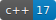](https://en.wikipedia.org/wiki/C%2B%2B#Standardization)
[](https://github.com/cpp-taskflow/cpp-taskflow/archive/master.zip)
[][wiki]
[][GitHub insights]
[](./LICENSE)

A fast C++ *header-only* library to help you quickly write parallel programs with complex task dependencies

# Why Cpp-Taskflow?

Cpp-Taskflow is by far faster, more expressive, fewer lines of code, and easier for drop-in integration
than existing parallel task programming libraries such as [OpenMP Tasking][OpenMP Tasking] and Intel [TBB FlowGraph][TBB FlowGraph].


Cpp-Taskflow enables you to implement efficient task decomposition strategies
that incorporate both regular loop-based parallelism 
and irregular compute patterns to optimize multicore performance.


| Without Cpp-Taskflow | With Cpp-Taskflow |
| -------------------- | ----------------- |
|  |  |

Cpp-Taskflow has a unified interface for both *static* tasking and *dynamic* tasking,
allowing users to quickly master our parallel task programming model in a natural idiom.

| Static Tasking | Dynamic Tasking |
| :------------: | :-------------: |
| 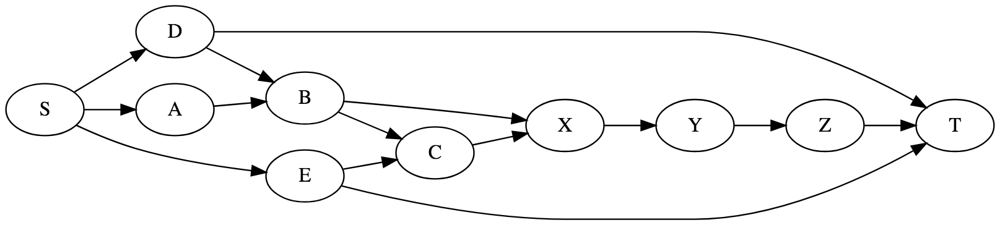 | 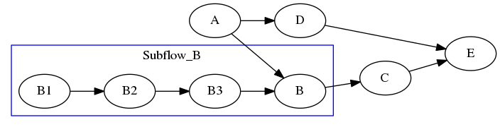 |

Cpp-Taskflow is committed to support both academic and industry research projects,
making it reliable and cost-effective for long-term and large-scale developments.

+ *"Cpp-Taskflow is the cleanest Task API I've ever seen." [damienhocking][damienhocking]*
+ *"Cpp-Taskflow has a very simple and elegant tasking interface. The performance also scales very well." [totalgee][totalgee]*
+ *"Best poster award for open-source parallel programming library." [Cpp Conference 2018][Cpp Conference 2018]*

See a quick [presentation][Presentation] and 
visit the [documentation][wiki] to learn more about Cpp-Taskflow.

# Get Started with Cpp-Taskflow

The following example [simple.cpp](./example/simple.cpp) shows the basic Cpp-Taskflow API
you need in most applications.

```cpp
#include <taskflow/taskflow.hpp>  // Cpp-Taskflow is header-only

int main(){
  
  tf::Taskflow tf;

  auto [A, B, C, D] = tf.emplace(
    [] () { std::cout << "TaskA\n"; },               //  task dependency graph
    [] () { std::cout << "TaskB\n"; },               // 
    [] () { std::cout << "TaskC\n"; },               //          +---+          
    [] () { std::cout << "TaskD\n"; }                //    +---->| B |-----+   
  );                                                 //    |     +---+     |
                                                     //  +---+           +-v-+ 
  A.precede(B);  // A runs before B                  //  | A |           | D | 
  A.precede(C);  // A runs before C                  //  +---+           +-^-+ 
  B.precede(D);  // B runs before D                  //    |     +---+     |    
  C.precede(D);  // C runs before D                  //    +---->| C |-----+    
                                                     //          +---+          
  tf.wait_for_all();  // block until finish

  return 0;
}
```

Compile and run the code with the following commands:

```bash
~$ g++ simple.cpp -std=c++1z -O2 -lpthread -o simple
~$ ./simple
TaskA
TaskC  <-- concurrent with TaskB
TaskB  <-- concurrent with TaskC
TaskD
```

It is clear now Cpp-Taskflow is powerful in parallelizing tasks with complex dependencies.
The following example demonstrates a concurrent execution of 10 tasks with 15 dependencies.
With Cpp-Taskflow, you only need ***15 lines of code***.

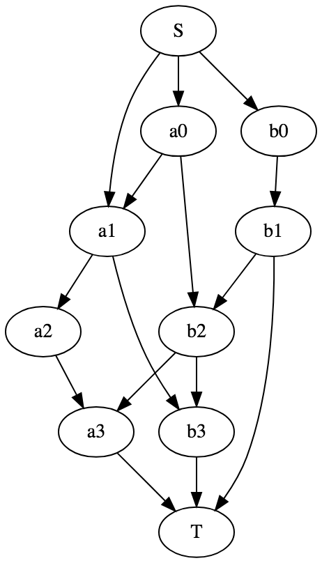

```cpp
// source dependencies
S.precede(a0);    // S runs before a0
S.precede(b0);    // S runs before b0
S.precede(a1);    // S runs before a1

// a_ -> others
a0.precede(a1);   // a0 runs before a1
a0.precede(b2);   // a0 runs before b2
a1.precede(a2);   // a1 runs before a2
a1.precede(b3);   // a1 runs before b3
a2.precede(a3);   // a2 runs before a3

// b_ -> others
b0.precede(b1);   // b0 runs before b1
b1.precede(b2);   // b1 runs before b2
b2.precede(b3);   // b2 runs before b3
b2.precede(a3);   // b2 runs before a3

// target dependencies
a3.precede(T);    // a3 runs before T
b1.precede(T);    // b1 runs before T
b3.precede(T);    // b3 runs before T
```

# Create a Taskflow Graph

Cpp-Taskflow has very expressive and neat methods to create dependency graphs.
Most applications are developed through the following three steps.

## Step 1: Create a Task

A task is a callable object for which [std::invoke][std::invoke] is applicable.
Create a taskflow object to start a task dependency graph.

```cpp
tf::Taskflow tf;
```

Create a task from a callable object via the method `emplace`
to get a task handle.

```cpp
tf::Task A = tf.emplace([](){ std::cout << "Task A\n"; });
```

You can create multiple tasks at one time.

```cpp
auto [A, B, C, D] = tf.emplace(
  [] () { std::cout << "Task A\n"; },
  [] () { std::cout << "Task B\n"; },
  [] () { std::cout << "Task C\n"; },
  [] () { std::cout << "Task D\n"; }
);
```

## Step 2: Define Task Dependencies

Once tasks are created in the pool, you need to specify task dependencies in a 
[Directed Acyclic Graph (DAG)](https://en.wikipedia.org/wiki/Directed_acyclic_graph) fashion.
The handle `Task` supports different methods for you to describe task dependencies.

**Precede**: Adding a preceding link forces one task to run ahead of one another.
```cpp
A.precede(B);  // A runs before B.
```

**Gather**: Adding a gathering link forces one task to run after other(s).
```cpp
A.gather(B);  // A runs after B
```

## Step 3: Execute the Tasks

There are three methods to execute a task dependency graph, 
`dispatch`, `silent_dispatch`, and `wait_for_all`.

```cpp
auto future = tf.dispatch();  // non-blocking, returns with a future immediately.
tf.silent_dispatch();         // non-blocking, no return
```

Calling `wait_for_all` will block until all tasks complete.

```cpp
tf.wait_for_all();
```

Each of these methods dispatches the current graph to threads for execution
and create a data structure called *topology* to store the execution status.


# Dynamic Tasking

Another powerful feature of Taskflow is *dynamic* tasking.
A dynamic task is created during the execution of a dispatched taskflow graph, i.e.,
topology.
These tasks are spawned by a parent task and are grouped together to a *subflow* graph.
The example below demonstrates how to create a subflow
that spawns three tasks during its execution.

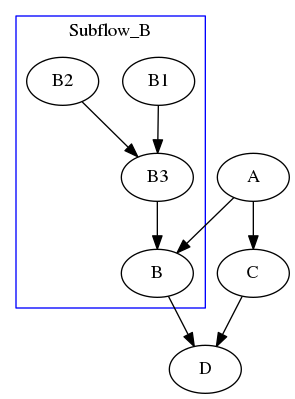

```cpp
// create three regular tasks
tf::Task A = tf.emplace([](){}).name("A");
tf::Task C = tf.emplace([](){}).name("C");
tf::Task D = tf.emplace([](){}).name("D");

// create a subflow graph (dynamic tasking)
tf::Task B = tf.emplace([] (tf::SubflowBuilder& subflow) {
  tf::Task B1 = subflow.emplace([](){}).name("B1");
  tf::Task B2 = subflow.emplace([](){}).name("B2");
  tf::Task B3 = subflow.emplace([](){}).name("B3");
  B1.precede(B3);
  B2.precede(B3);
}).name("B");
            
A.precede(B);  // B runs after A 
A.precede(C);  // C runs after A 
B.precede(D);  // D runs after B 
C.precede(D);  // D runs after C 

// execute the graph without cleanning up topologies
tf.dispatch().get();
tf.dump_topologies(std::cout);
```

By default, a subflow graph joins to its parent node. 
This guarantees a subflow graph to finish before the successors of 
its parent node.
You can disable this feature by calling `subflow.detach()`.
Detaching the above subflow will result in the following execution flow.

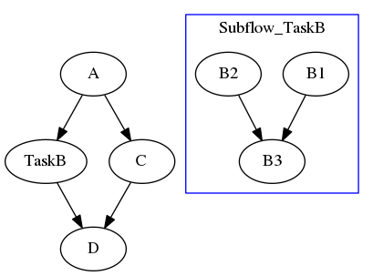

```cpp
// create a "detached" subflow graph (dynamic tasking)
tf::Task B = tf.emplace([] (tf::SubflowBuilder& subflow) {
  tf::Task B1 = subflow.emplace([](){}).name("B1");
  tf::Task B2 = subflow.emplace([](){}).name("B2");
  tf::Task B3 = subflow.emplace([](){}).name("B3");
  B1.precede(B3);
  B2.precede(B3);

  // detach this subflow from task B
  subflow.detach();
}).name("B");
```

## Step 1: Create a Subflow

Cpp-Taskflow has an unified interface for static and dynamic tasking.
To create a subflow for dynamic tasking, 
emplace a callable on one argument of type `tf::SubflowBuilder`.

```cpp
tf::Task A = tf.emplace([] (tf::SubflowBuilder& subflow) {});
```

Similarly, you can get a [std::future][std::future] object to the execution status of the subflow.

```cpp
auto [A, fu] = tf.emplace([] (tf::SubflowBuilder& subflow) {});
```

A subflow builder is a lightweight object that allows you to create 
arbitrary dependency graphs on the fly.
All graph building methods defined in taskflow
can be used in a subflow builder.

```cpp
tf::Task A = tf.emplace([] (tf::SubflowBuilder& subflow) {
  std::cout << "Task A is spawning two subtasks A1 and A2" << '\n';
  auto [A1, A2] = subflow.emplace(
    [] () { std::cout << "subtask A1" << '\n'; },
    [] () { std::cout << "subtask A2" << '\n'; }
    A1.precede(A2);
  );
});
```

A subflow can also be nested or recursive. You can create another subflow from
the execution of a subflow and so on.

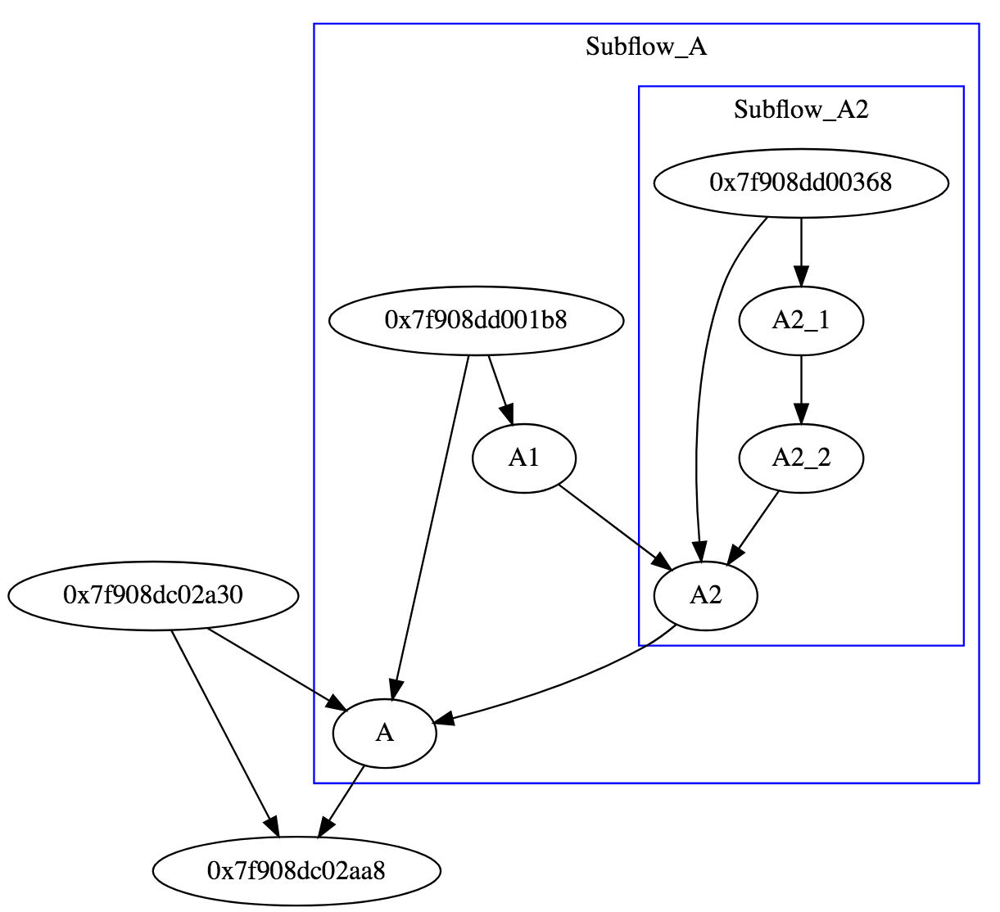

```cpp
tf::Task A = tf.emplace([] (tf::SubflowBuilder& sbf) {
  std::cout << "A spawns A1 & subflow A2\n";
  tf::Task A1 = sbf.emplace([] () { 
    std::cout << "subtask A1\n"; 
  }).name("A1");

  tf::Task A2 = sbf.emplace([] (tf::SubflowBuilder& sbf2) {
    std::cout << "A2 spawns A2_1 & A2_2\n";
    tf::Task A2_1 = sbf2.emplace([] () { 
      std::cout << "subtask A2_1\n"; 
    }).name("A2_1");
    tf::Task A2_2 = sbf2.emplace([] () { 
      std::cout << "subtask A2_2\n"; 
    }).name("A2_2");
    A2_1.precede(A2_2);
  }).name("A2");

  A1.precede(A2);
}).name("A");
```

## Step 2: Detach or Join a Subflow

A subflow has no methods to dispatch its tasks.
Instead, a subflow will be executed after leaving the context of the callable.
By default, a subflow joins to its parent task.
Depending on applications, you can detach a subflow to enable more parallelism.

```cpp
tf::Task A = tf.emplace([] (tf::SubflowBuilder& subflow) {
  subflow.detach();  // detach this subflow from its parent task A
});  // subflow starts to run after the callable scope
```

Detaching or Joining a subflow has different meaning in the ready status of 
the future object referred to it.
In a joined subflow, 
the completion of its parent node is defined as when all tasks
inside the subflow (possibly nested) finish.

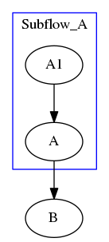

```cpp
int value {0};

// create a joined subflow
tf::Task A = tf.emplace([&] (tf::SubflowBuilder& subflow) {
  subflow.emplace([&]() { 
    value = 10; 
  }).name("A1");
}).name("A");

// create a task B after A
tf::Task B = tf.emplace([&] () { 
  assert(value == 10); 
}).name("B");

// A1 must finish before A and therefore before B
A.precede(B);
```

When a subflow is detached from its parent task, it becomes a parallel
execution line to the current flow graph and will eventually
join to the same topology.


```cpp
int value {0};

// create a detached subflow
tf::Task A = tf.emplace([&] (tf::SubflowBuilder& subflow) {
  subflow.emplace([&]() { value = 10; }).name("A1");
  subflow.detach();
}).name("A");

// create a task B after A
tf::Task B = tf.emplace([&] () { 
  // no guarantee for value to be 10
}).name("B");

A.precede(B);
```


# Debug a Taskflow Graph

Concurrent programs are notoriously difficult to debug.
Cpp-Taskflow leverages the graph properties to relieve the debugging pain.
To debug a taskflow graph,
(1) name tasks and dump the graph, and
(2) start with one thread before going multiple.
Currently, Cpp-Taskflow supports [GraphViz][GraphViz] format.

## Dump the Present Taskflow Graph

Each time you create a task or add a dependency, 
it adds a node or an edge to the present taskflow graph.
The graph is not dispatched yet and you can dump it to a GraphViz format.

```cpp
// debug.cpp
tf::Taskflow tf(0);  // use only the master thread

tf::Task A = tf.emplace([] () {}).name("A");
tf::Task B = tf.emplace([] () {}).name("B");
tf::Task C = tf.emplace([] () {}).name("C");
tf::Task D = tf.emplace([] () {}).name("D");
tf::Task E = tf.emplace([] () {}).name("E");

A.precede(B, C, E); 
C.precede(D);
B.precede(D, E); 

tf.dump(std::cout);
```

Run the program and inspect whether dependencies are expressed in the right way. 
There are a number of free [GraphViz tools][AwesomeGraphViz] you could find online
to visualize your Taskflow graph.


```bash
~$ ./debug

// Taskflow with five tasks and six dependencies
digraph Taskflow {
  "A" -> "B"
  "A" -> "C"
  "A" -> "E"
  "B" -> "D"
  "B" -> "E"
  "C" -> "D"
}
```

## Dump a Dispatched Graph

When you have dynamic tasks (subflows),
you cannot simply use the `dump` method because it displays only the static portion.
Instead, you need to execute the graph first to include dynamic tasks
and then use the `dump_topologies` method.

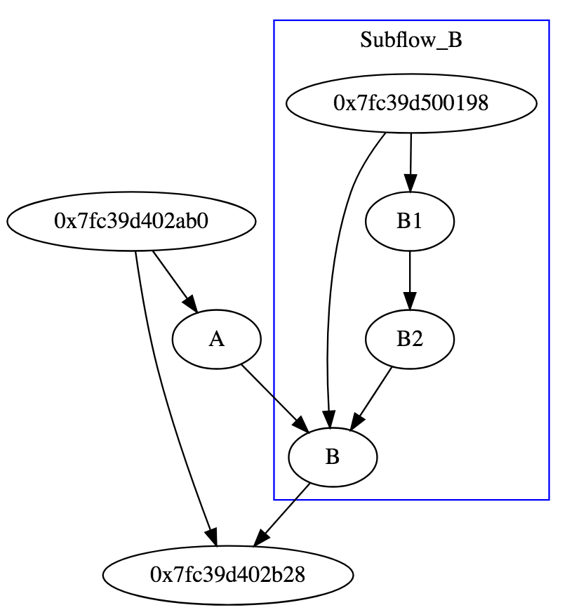

```cpp
tf::Taskflow tf(0);  // use only the master thread

tf::Task A = tf.emplace([](){}).name("A");

// create a subflow of two tasks B1->B2
tf::Task B = tf.emplace([] (tf::SubflowBuilder& subflow) {
  tf::Task B1 = subflow.emplace([](){}).name("B1");
  tf::Task B2 = subflow.emplace([](){}).name("B2");
  B1.precede(B2);
}).name("B");

A.precede(B);

// dispatch the graph without cleanning up topologies
tf.dispatch().get();

// dump the entire graph (including dynamic tasks)
tf.dump_topologies(std::cout);
```

# API Reference

## Taskflow API

The class `tf::Taskflow` is the main place to create and execute task dependency graph.
The table below summarizes a list of commonly used methods.
Visit [documentation][wiki] to see the complete list.

| Method   | Argument  | Return  | Description |
| -------- | --------- | ------- | ----------- |
| Taskflow | none      | none    | construct a taskflow with the worker count equal to max hardware concurrency |
| Taskflow | size      | none    | construct a taskflow with a given number of workers |
| emplace  | callables | tasks   | create a task with a given callable(s) |
| placeholder     | none        | task         | insert a node without any work; work can be assigned later |
| linearize       | task list   | none         | create a linear dependency in the given task list |
| parallel_for    | beg, end, callable, group | task pair | apply the callable in parallel and group-by-group to the result of dereferencing every iterator in the range | 
| parallel_for    | beg, end, step, callable, group | task pair | apply the callable in parallel and group-by-group to a index-based range | 
| reduce | beg, end, res, bop | task pair | reduce a range of elements to a single result through a binary operator | 
| transform_reduce | beg, end, res, bop, uop | task pair | apply a unary operator to each element in the range and reduce them to a single result through a binary operator | 
| dispatch        | none        | future | dispatch the current graph and return a shared future to block on completion |
| silent_dispatch | none        | none | dispatch the current graph | 
| wait_for_all    | none        | none | dispatch the current graph and block until all graphs finish, including all previously dispatched ones, and then clear all graphs |
| wait_for_topologies | none    | none | block until all dispatched graphs (topologies) finish, and then clear these graphs |
| num_nodes       | none        | size | query the number of nodes in the current graph |  
| num_workers     | none        | size | query the number of working threads in the pool |  
| num_topologies  | none        | size | query the number of dispatched graphs |
| dump            | none        | string | dump the current graph to a string of GraphViz format |
| dump_topologies | none        | string | dump dispatched topologies to a string of GraphViz format |

### *emplace/placeholder*

You can use `emplace` to create a task for a target callable.

```cpp
// create a task through emplace
tf::Task task = tf.emplace([] () { std::cout << "my task\n"; });
tf.wait_for_all();
```

When task cannot be determined beforehand, you can create a placeholder and assign the calalble later.

```cpp
// create a placeholder and use it to build dependency
tf::Task A = tf.emplace([](){});
tf::Task B = tf.placeholder();
A.precede(B);

// assign the callable later in the control flow
B.work([](){ /* do something */ });
```

### *linearize*

The method `linearize` lets you add a linear dependency between each adjacent pair of a task sequence.

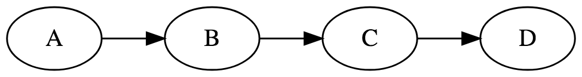

```cpp
// linearize five tasks
tf.linearize(A, B, C, D);
```

### *parallel_for*

The method `parallel_for` creates a subgraph that applies the callable to each item in the given range of
a container.

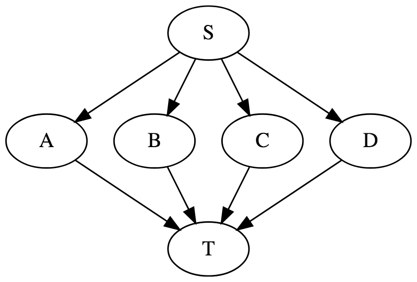

```cpp
// apply callable to each container item in parallel
auto v = {'A', 'B', 'C', 'D'};
auto [S, T] = tf.parallel_for(
  v.begin(),    // beg of range
  v.end(),      // end of range
  [] (int i) { 
    std::cout << "parallel in " << i << '\n';
  }
);
// add dependencies via S and T.
```

Changing the group size can force intra-group tasks to run sequentially
and inter-group tasks to run in parallel.
Depending on applications, different group sizes can result in significant performance hit.

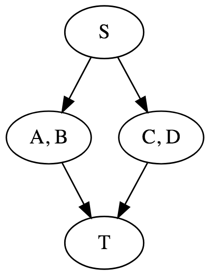

```cpp
// apply callable to two container items at a time in parallel
auto v = {'A', 'B', 'C', 'D'};
auto [S, T] = tf.parallel_for(
  v.begin(),    // beg of range
  v.end(),      // end of range
  [] (int i) { 
    std::cout << "AB and CD run in parallel" << '\n';
  },
  2  // group two tasks at a time
);
```

By default, taskflow performs an even partition over worker threads
if the group size is not specified (or equal to 0).

In addition to range-based iterator, parallel\_for has another overload on an index-based loop.
The first three argument to this overload indicates 
starting index, ending index (exclusive), and step size.

```cpp
// [0, 10) with a step size of 2
auto [S, T] = tf.parallel_for(
  0, 10, 2, 
  [] (int i) {
    std::cout << "parallel_for on index " << i << std::endl;
  }, 
  2  // group two tasks at a time
);
// will print 0, 2, 4, 6, 8 (three groups, {0, 2}, {4, 6}, {8})
```

You can also go opposite direction by reversing the starting index and the ending index
with a negative step size.

```cpp
// [10, 0) with a step size of -2
auto [S, T] = tf.parallel_for(
  10, 0, 2, 
  [] (int i) {
    std::cout << "parallel_for on index " << i << std::endl;
  }
);
// will print 10, 8, 6, 4, 2 (group size decided by taskflow)
```

### *reduce/transform_reduce*

The method `reduce` creates a subgraph that applies a binary operator to a range of items.
The result will be stored in the referenced `res` object passed to the method. 
It is your responsibility to assign it a correct initial value to reduce.

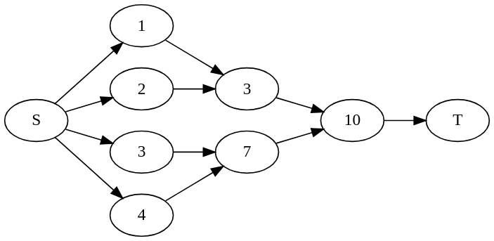

```cpp
auto v = {1, 2, 3, 4}; 
int sum {0};
auto [S, T] = tf.reduce(    // for example, 2 threads
  v.begin(), v.end(), sum, std::plus<int>()
);  
```

The method `transform_reduce` is similar to reduce, except it applies a unary operator before reduction.
This is particular useful when you need additional data processing to reduce a range of elements.

```cpp
std::vector<std::pari<int, int>> v = { {1, 5}, {6, 4}, {-6, 4} };
int min = std::numeric_limits<int>::max();
auto [S, T] = tf.transform_reduce(v.begin(), v.end(), min, 
  [] (int l, int r) { return std::min(l, r); },
  [] (const std::pair<int, int>& pair) { return std::min(p.first, p.second); }
);
```

By default, all reduce methods distribute the workload evenly across threads.

### *dispatch/silent_dispatch/wait_for_topologies/wait_for_all*

Dispatching a taskflow graph will schedule threads to execute the current graph and return immediately.
The method `dispatch` gives you a [std::future][std::future] object to probe the execution progress while
`silent_dispatch` doesn't.

```cpp
auto future = tf.dispatch();
// do something else to overlap with the execution 
// ...
std::cout << "now I need to block on completion" << '\n';
future.get();
std::cout << "all tasks complete" << '\n';
```

If you need to block your program flow until all tasks finish 
(including the present taskflow graph), use `wait_for_all` instead.

```cpp
tf.wait_for_all();
std::cout << "all tasks complete" << '\n';
```

If you only need to block your program flow until all dispatched taskflow graphs finish,
use `wait_for_topologies`.

```cpp
tf.wait_for_topologies();
std::cout << "all topologies complete" << '\n';
```

## Task API

Each time you create a task, the taskflow object adds a node to the present task dependency graph
and return a *task handle* to you.
A task handle is a lightweight object that defines a set of methods for users to
access and modify the attributes of the associated task.
The table below summarizes the list of commonly used methods.
Visit [documentation][wiki] to see the complete list.

| Method         | Argument    | Return | Description |
| -------------- | ----------- | ------ | ----------- |
| name           | string      | self   | assign a human-readable name to the task |
| work           | callable    | self   | assign a work of a callable object to the task |
| precede        | task list   | self   | enable this task to run *before* the given tasks |
| gather         | task list   | self   | enable this task to run *after* the given tasks |
| num_dependents | none        | size   | return the number of dependents (inputs) of this task |
| num_successors | none        | size   | return the number of successors (outputs) of this task |

### *name*

The method `name` lets you assign a human-readable string to a task.

```cpp
A.name("my name is A");
```

### *work*

The method `work` lets you assign a callable to a task.

```cpp
A.work([] () { std::cout << "hello world!"; });
```

### *precede*

The method `precede` is the basic building block to add a precedence between two tasks.

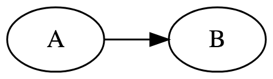

```cpp
// make A runs before B
A.precede(B);
```

You can precede multiple tasks at one time.

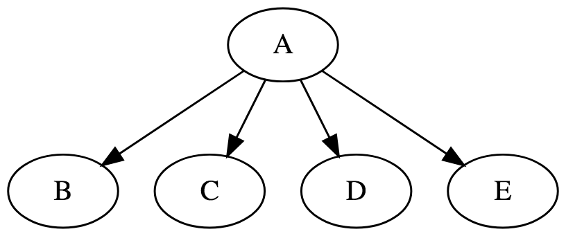

```cpp
// make A run before B, C, D, and E
// B, C, D, and E run in parallel
A.precede(B, C, D, E);
```

### *gather*

The method `gather` lets you add multiple precedences to a task.

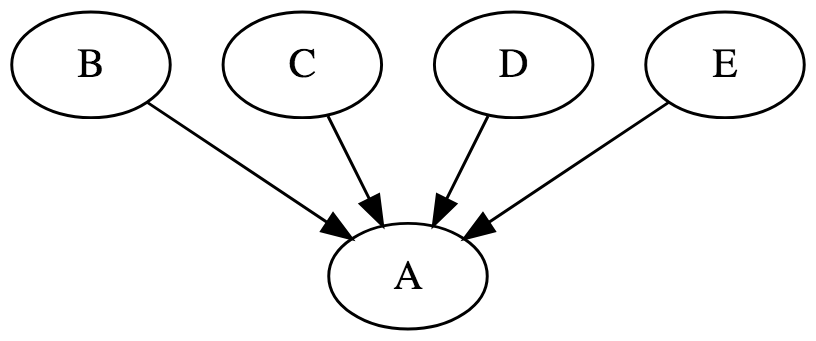

```cpp
// B, C, D, and E run in parallel
// A runs after B, C, D, and E complete
A.gather(B, C, D, E);
```

# Caveats

While Cpp-Taskflow enables the expression of very complex task dependency graph that might contain 
thousands of task nodes and links, there are a few amateur pitfalls and mistakes to be aware of.

+ Having a cycle in a graph may result in running forever
+ Trying to modify a dispatched task can result in undefined behavior
+ Touching a taskflow from multiple threads are not safe

Cpp-Taskflow is known to work on Linux distributions, MAC OSX, and Microsoft Visual Studio.
Please [let me know][email me] if you found any issues in a particular platform.

# System Requirements

To use Cpp-Taskflow, you only need a [C++17][C++17] compiler:
+ GNU C++ Compiler v7.3 with -std=c++1z
+ Clang C++ Compiler v6.0 with -std=c++17
+ Microsoft Visual Studio Version 15.7 (MSVC++ 19.14)

# Compile Unit Tests and Examples

Cpp-Taskflow uses [CMake](https://cmake.org/) to build examples and unit tests.
We recommend using out-of-source build.

```bash
~$ cmake --version  # must be at least 3.9 or higher
~$ mkdir build
~$ cd build
~$ cmake ../
~$ make 
```

## Unit Tests

Cpp-Taskflow uses [Doctest](https://github.com/onqtam/doctest) for unit tests.

```bash
~$ ./unittest/taskflow
```

Alternatively, you can use CMake's testing framework to run the unittest.

```bash
~$ cd build
~$ make test
```

## Examples

The folder `example/` contains several examples and is a great place to learn to use Cpp-Taskflow.

| Example |  Description |
| ------- |  ----------- | 
| [simple.cpp](./example/simple.cpp) | uses basic task building blocks to create a trivial taskflow  graph |
| [debug.cpp](./example/debug.cpp)| inspects a taskflow through the dump method |
| [matrix.cpp](./example/matrix.cpp) | creates two set of matrices and multiply each individually in parallel |
| [dispatch.cpp](./example/dispatch.cpp) | demonstrates how to dispatch a task dependency graph and assign a callback to execute |
| [multiple_dispatch.cpp](./example/multiple_dispatch.cpp) | illustrates dispatching multiple taskflow graphs as independent batches (which all run on the same threadpool) |
| [parallel_for.cpp](./example/parallel_for.cpp)| parallelizes a for loop with unbalanced workload |
| [reduce.cpp](./example/reduce.cpp)| performs reduce operations over linear containers |
| [subflow.cpp](./example/subflow.cpp)| demonstrates how to create a subflow graph that spawns three dynamic tasks |
| [threadpool.cpp](./example/threadpool.cpp)| benchmarks different threadpool implementations |
| [threadpool_cxx14.cpp](./example/threadpool_cxx14.cpp)| shows use of the C++14-compatible threadpool implementation, which may be used when you have no inter-task (taskflow) dependencies to express |
| [taskflow.cpp](./example/taskflow.cpp)| benchmarks taskflow on different task dependency graphs |
| [executor.cpp](./example/executor.cpp)| shows how to create multiple taskflow objects sharing one executor to avoid the thread over-subscription problem |
| [framework.cpp](./example/framework.cpp)| shows the usage of framework to create reusable task dependency graphs |

# Get Involved

+ Report bugs/issues by submitting a [GitHub issue][GitHub issues]
+ Submit contributions using [pull requests][GitHub pull requests]
+ Learn more about Cpp-Taskflow by reading the [documentation][wiki]

# Who is Using Cpp-Taskflow?

Cpp-Taskflow is being used in both industry and academic projects to scale up existing workloads 
that incorporate complex task dependencies. 

- [OpenTimer][OpenTimer]: A High-performance Timing Analysis Tool for Very Large Scale Integration (VLSI) Systems
- [DtCraft][DtCraft]: A General-purpose Distributed Programming Systems using Data-parallel Streams
- [Firestorm][Firestorm]: Fighting Game Engine with Asynchronous Resource Loaders (developed by [ForgeMistress][ForgeMistress])
- [Shiva][Shiva]: An extensible engine via an entity component system through scripts, DLLs, and header-only (C++)

[More...](https://github.com/search?q=cpp-taskflow&type=Code)

# Contributors

Cpp-Taskflow is being actively developed and contributed by the following people:

- [Tsung-Wei Huang][Tsung-Wei Huang] created the Cpp-Taskflow project and implemented the core routines
- [Chun-Xun Lin][Chun-Xun Lin] co-created the Cpp-Taskflow project and implemented the core routines
- [Martin Wong][Martin Wong] supported the Cpp-Taskflow project through NSF and DARPA funding
- [Andreas Olofsson][Andreas Olofsson] supported the Cpp-Taskflow project through the DARPA IDEA project
- [Nan Xiao](https://github.com/NanXiao) fixed compilation error of unittest on the Arch platform
- [Vladyslav](https://github.com/innermous) fixed comment errors in README.md and examples
- [vblanco20-1](https://github.com/vblanco20-1) fixed compilation error on Microsoft Visual Studio
- [Glen Fraser](https://github.com/totalgee) created a standalone C++14-compatible [threadpool](./taskflow/threadpool/threadpool_cxx14.hpp) for taskflow; various other fixes and examples
- [Guannan Guo](https://github.com/gguo4) added different threadpool implementations to enhance the performance for taskflow
- [Patrik Huber][Patrik Huber] helped fixed typos in the documentation
- [ForgeMistress][ForgeMistress] provided API ideas about sharing the executor to avoid thread over-subscriptiong issues
- [Alexander Neumann](https://github.com/Neumann-A) helped modify the cmake build to make Cpp-Taskflow importable from external cmake projects
- [Paolo Bolzoni](https://github.com/paolobolzoni) helped remove extraneous semicolons to suppress extra warning during compilation

Meanwhile, we appreciate the support from many organizations for our development on Cpp-Taskflow.
Please [let me know][email me] if I forgot someone!

| [][UIUC] | [][CSL] | [][NSF] | [][DARPA IDEA] |
| :---: | :---: | :---: | :---: |


# License

Cpp-Taskflow is licensed under the [MIT License](./LICENSE).

* * *

[Tsung-Wei Huang]:       https://twhuang.ece.illinois.edu/
[Chun-Xun Lin]:          https://github.com/clin99
[Martin Wong]:           https://ece.illinois.edu/directory/profile/mdfwong
[Andreas Olofsson]:      https://github.com/aolofsson
[Gitter]:                https://gitter.im/cpp-taskflow/Lobby
[Gitter badge]:          ./image/gitter_badge.svg
[GitHub releases]:       https://github.com/coo-taskflow/cpp-taskflow/releases
[GitHub issues]:         https://github.com/cpp-taskflow/cpp-taskflow/issues
[GitHub insights]:       https://github.com/cpp-taskflow/cpp-taskflow/pulse
[GitHub pull requests]:  https://github.com/cpp-taskflow/cpp-taskflow/pulls
[GraphViz]:              https://www.graphviz.org/
[AwesomeGraphViz]:       https://github.com/CodeFreezr/awesome-graphviz
[OpenMP Tasking]:        http://www.nersc.gov/users/software/programming-models/openmp/openmp-tasking/
[TBB FlowGraph]:         https://www.threadingbuildingblocks.org/tutorial-intel-tbb-flow-graph
[OpenTimer]:             https://github.com/OpenTimer/OpenTimer
[DtCraft]:               http://dtcraft.web.engr.illinois.edu/
[totalgee]:              https://github.com/totalgee
[damienhocking]:         https://github.com/damienhocking
[ForgeMistress]:         https://github.com/ForgeMistress
[Patrik Huber]:          https://github.com/patrikhuber
[DARPA IDEA]:            https://www.darpa.mil/news-events/2017-09-13
[NSF]:                   https://www.nsf.gov/
[UIUC]:                  https://illinois.edu/
[CSL]:                   https://csl.illinois.edu/
[wiki]:                  https://cpp-taskflow.github.io/cpp-taskflow/index.html
[PayMe]:                 https://www.paypal.me/twhuang/10
[C++17]:                 https://en.wikipedia.org/wiki/C%2B%2B17
[email me]:              mailto:twh760812@gmail.com
[Cpp Conference 2018]:   https://github.com/CppCon/CppCon2018

[std::invoke]:           https://en.cppreference.com/w/cpp/utility/functional/invoke
[std::future]:           https://en.cppreference.com/w/cpp/thread/future

[Firestorm]:             https://github.com/ForgeMistress/Firestorm
[Shiva]:                 https://shiva.gitbook.io/project/shiva

[Presentation]:          https://cpp-taskflow.github.io/


