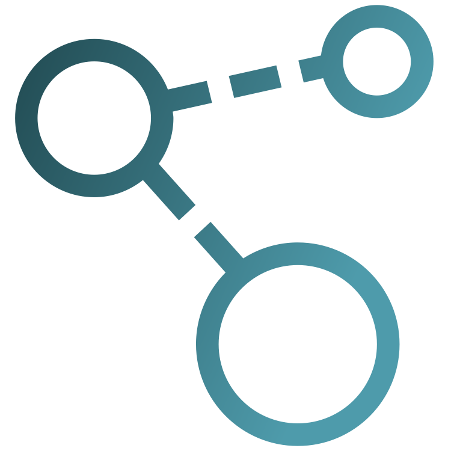
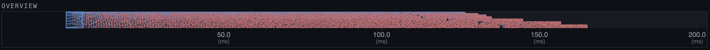

# Taskflow 

[](https://github.com/taskflow/taskflow/actions?query=workflow%3AUbuntu)
[](https://github.com/taskflow/taskflow/actions?query=workflow%3AmacOS)
[](https://github.com/taskflow/taskflow/actions?query=workflow%3AWindows)
[][documentation]
[](https://taskflow.github.io/tfprof/)
[][TPDS22]

Taskflow helps you quickly write high-performance task-parallel programs with high programming productivity.
It is faster, more expressive, fewer lines of code, and easier for drop-in integration
than many existing task programming libraries.

## Start Your First Taskflow Program

The following program (`simple.cpp`) creates four tasks `A`, `B`, `C`, and `D`,
where `A` runs before `B` and `C`, and `D` runs after `B` and `C`.
When `A` finishes, `B` and `C` run in parallel.
Try it live on [Compiler Explorer](https://godbolt.org/z/j8hx3xnnx)!

```cpp
#include <taskflow/taskflow.hpp>  // Taskflow is header-only

int main(){
  
  tf::Executor executor;
  tf::Taskflow taskflow;

  auto [A, B, C, D] = taskflow.emplace(  // create four tasks
    [] () { std::cout << "TaskA\n"; },
    [] () { std::cout << "TaskB\n"; },
    [] () { std::cout << "TaskC\n"; },
    [] () { std::cout << "TaskD\n"; } 
  );                                  
                                      
  A.precede(B, C);  // A runs before B and C
  D.succeed(B, C);  // D runs after  B and C
                                      
  executor.run(taskflow).wait(); 

  return 0;
}
```

Taskflow is *header-only* and there is no struggle with installation.
To compile the program, clone the Taskflow project and
tell the compiler to include the headers under `taskflow/`.

```bash
~$ git clone https://github.com/taskflow/taskflow.git  # clone it only once
~$ g++ -std=c++20 simple.cpp -I taskflow/ -O2 -pthread -o simple
~$ ./simple
TaskA
TaskC 
TaskB 
TaskD
```

Taskflow comes with a built-in profiler, [TFProf](https://taskflow.github.io/tfprof/),
for you to profile and visualize taskflow programs in an easy-to-use web-based interface.

```bash
# run the program with the environment variable TF_ENABLE_PROFILER enabled
~$ TF_ENABLE_PROFILER=simple.tfp ./simple
# drag the simple.tfp file to https://taskflow.github.io/tfprof/
```



## Create a Subflow Graph

Taskflow supports *recursive tasking* for you to create a subflow graph
from the execution of a task to perform recursive parallelism.
The following program spawns a task dependency graph parented at task `B`.

```cpp
tf::Task A = taskflow.emplace([](){}).name("A");  
tf::Task C = taskflow.emplace([](){}).name("C");  
tf::Task D = taskflow.emplace([](){}).name("D");  

tf::Task B = taskflow.emplace([] (tf::Subflow& subflow) { // subflow task B
  tf::Task B1 = subflow.emplace([](){}).name("B1");  
  tf::Task B2 = subflow.emplace([](){}).name("B2");  
  tf::Task B3 = subflow.emplace([](){}).name("B3");  
  B3.succeed(B1, B2);  // B3 runs after B1 and B2
}).name("B");

A.precede(B, C);  // A runs before B and C
D.succeed(B, C);  // D runs after  B and C
```

## Integrate Control Flow into a Task Graph

Taskflow supports *conditional tasking* for you to make rapid
control-flow decisions across dependent tasks to implement cycles
and conditions in an end-to-end task graph.

```cpp
tf::Task init = taskflow.emplace([](){}).name("init");
tf::Task stop = taskflow.emplace([](){}).name("stop");

// creates a condition task that returns a random binary
tf::Task cond = taskflow.emplace([](){ return std::rand() % 2; }).name("cond");

// creates a feedback loop {0: cond, 1: stop}
init.precede(cond);
cond.precede(cond, stop);  // moves on to 'cond' on returning 0, or 'stop' on 1
```

## Compose Task Graphs

Taskflow is composable. You can create large parallel graphs through
composition of modular and reusable blocks that are easier to optimize
at an individual scope.

```cpp
tf::Taskflow f1, f2;

// create taskflow f1 of two tasks
tf::Task f1A = f1.emplace([]() { std::cout << "Task f1A\n"; }).name("f1A");
tf::Task f1B = f1.emplace([]() { std::cout << "Task f1B\n"; }).name("f1B");

// create taskflow f2 with one module task composed of f1
tf::Task f2A = f2.emplace([]() { std::cout << "Task f2A\n"; }).name("f2A");
tf::Task f2B = f2.emplace([]() { std::cout << "Task f2B\n"; }).name("f2B");
tf::Task f2C = f2.emplace([]() { std::cout << "Task f2C\n"; }).name("f2C");
tf::Task f1_module_task = f2.composed_of(f1).name("module");

f1_module_task.succeed(f2A, f2B)
              .precede(f2C);
```

## Launch Asynchronous Tasks

Taskflow supports *asynchronous* tasking.
You can launch tasks asynchronously to dynamically explore task graph parallelism.

```cpp
tf::Executor executor;

// create asynchronous tasks directly from an executor
std::future<int> future = executor.async([](){ 
  std::cout << "async task returns 1\n";
  return 1;
}); 
executor.silent_async([](){ std::cout << "async task does not return\n"; });

// create asynchronous tasks with dynamic dependencies
tf::AsyncTask A = executor.silent_dependent_async([](){ printf("A\n"); });
tf::AsyncTask B = executor.silent_dependent_async([](){ printf("B\n"); }, A);
tf::AsyncTask C = executor.silent_dependent_async([](){ printf("C\n"); }, A);
tf::AsyncTask D = executor.silent_dependent_async([](){ printf("D\n"); }, B, C);

executor.wait_for_all();
```

## Leverage Standard Parallel Algorithms

Taskflow defines algorithms for you to quickly express common parallel patterns
using standard C++ syntaxes, such as parallel iterations, reductions, and sort.

```cpp
tf::Task task1 = taskflow.for_each( // assign each element to 100 in parallel
  first, last, [] (auto& i) { i = 100; }    
);
tf::Task task2 = taskflow.reduce(   // reduce a range of items in parallel
  first, last, init, [] (auto a, auto b) { return a + b; }
);
tf::Task task3 = taskflow.sort(     // sort a range of items in parallel
  first, last, [] (auto a, auto b) { return a < b; }
);
```

Taskflow also provides composable graph building blocks for common parallel
algorithms such as parallel pipeline.

```cpp
// create a pipeline to propagate five tokens through three serial stages
tf::Pipeline pl(num_lines,
  tf::Pipe{tf::PipeType::SERIAL, [](tf::Pipeflow& pf) {
    if(pf.token() == 5) pf.stop();
  }},
  tf::Pipe{tf::PipeType::SERIAL, [](tf::Pipeflow& pf) {
    printf("stage 2: input buffer[%zu] = %d\n", pf.line(), buffer[pf.line()]);
  }},
  tf::Pipe{tf::PipeType::SERIAL, [](tf::Pipeflow& pf) {
    printf("stage 3: input buffer[%zu] = %d\n", pf.line(), buffer[pf.line()]);
  }}
);
taskflow.composed_of(pl);
executor.run(taskflow).wait();
```

## Offload Tasks to a GPU

Taskflow supports GPU tasking for you to accelerate scientific computing
applications by harnessing the power of CPU-GPU collaborative computing
using Nvidia CUDA Graph.

```cpp
tf::Task cudaflow = taskflow.emplace([&]() {
  tf::cudaGraph cg;
  tf::cudaTask h2d_x = cg.copy(dx, hx.data(), N);
  tf::cudaTask h2d_y = cg.copy(dy, hy.data(), N);
  tf::cudaTask d2h_x = cg.copy(hx.data(), dx, N);
  tf::cudaTask d2h_y = cg.copy(hy.data(), dy, N);
  tf::cudaTask saxpy = cg.kernel((N+255)/256, 256, 0, saxpy, N, 2.0f, dx, dy);
  saxpy.succeed(h2d_x, h2d_y)
       .precede(d2h_x, d2h_y);
  tf::cudaGraphExec exec(cg);
  tf::cudaStream stream;
  stream.run(exec).synchronize();
}).name("CUDA Graph Task");
```

## Run a Taskflow through an Executor

The executor provides several *thread-safe* methods to run a taskflow.
You can run a taskflow once, multiple times, or until a stopping criteria is met.
These methods are non-blocking with a `tf::Future<void>` return
to let you query the execution status.

```cpp
// runs the taskflow once
tf::Future<void> run_once = executor.run(taskflow); 

// wait on this run to finish
run_once.get();

// run the taskflow four times
executor.run_n(taskflow, 4);

// runs the taskflow five times
executor.run_until(taskflow, [counter=5](){ return --counter == 0; });

// blocks the executor until all submitted taskflows complete
executor.wait_for_all();
```

## Visualize a Taskflow Graph

You can dump a taskflow graph to a DOT format and visualize it
using free [GraphViz][GraphViz] tools.

```cpp
// dump the taskflow graph to a DOT format through std::cout
taskflow.dump(std::cout); 
```

## Supported Compilers

To use Taskflow v4.0.0, you need a compiler that supports C++20:

+ GNU C++ Compiler at least v11.0 with -std=c++20
+ Clang C++ Compiler at least v12.0 with -std=c++20
+ Microsoft Visual Studio at least v19.29 (VS 2019) with /std:c++20
+ Apple Clang (Xcode) at least v13.0 with -std=c++20
+ NVIDIA CUDA Toolkit and Compiler (nvcc) at least v12.0 with host compiler supporting C++20
+ Intel oneAPI DPC++/C++ Compiler at least v2022.0 with -std=c++20

Taskflow works on Linux, Windows, and Mac OS X.

## Get Involved

Visit our [project website][Project Website] and [documentation][documentation]
to learn more about Taskflow. To get involved:

+ See [release notes][release notes] to stay up-to-date with newest versions
+ Read the step-by-step tutorial at [cookbook][cookbook]
+ Submit an issue at [GitHub issues][GitHub issues]
+ Learn more about our technical details at [references][references]
+ Watch our [technical talks](https://www.youtube.com/watch?v=u4vaY0cjzos) on YouTube

We are committed to support trustworthy developments for
both academic and industrial research projects in parallel
and heterogeneous computing.
If you are using Taskflow, please cite the following paper we published at 2022 IEEE TPDS:

+ Tsung-Wei Huang, Dian-Lun Lin, Chun-Xun Lin, and Yibo Lin, &quot;[Taskflow: A Lightweight Parallel and Heterogeneous Task Graph Computing System](https://tsung-wei-huang.github.io/papers/tpds21-taskflow.pdf),&quot; *IEEE Transactions on Parallel and Distributed Systems (TPDS)*, vol. 33, no. 6, pp. 1303-1320, June 2022

More importantly, we appreciate all Taskflow [contributors][contributors] and
the following organizations for sponsoring the Taskflow project!

| | | | |
|:---:|:---:|:---:|:---:|
|||||
|||||

## License

Taskflow is open-source under the permissive [MIT License](./LICENSE).
You are completely free to use, modify, and redistribute any work derived from Taskflow.

* * *

[GraphViz]:             https://www.graphviz.org/
[Project Website]:      https://taskflow.github.io/
[contributors]:         https://taskflow.github.io/taskflow/contributors.html
[documentation]:        https://taskflow.github.io/taskflow/index.html
[release notes]:        https://taskflow.github.io/taskflow/Releases.html
[cookbook]:             https://taskflow.github.io/taskflow/pages.html
[references]:           https://taskflow.github.io/taskflow/References.html
[GitHub issues]:        https://github.com/taskflow/taskflow/issues
[TPDS22]:               https://tsung-wei-huang.github.io/papers/tpds21-taskflow.pdf
