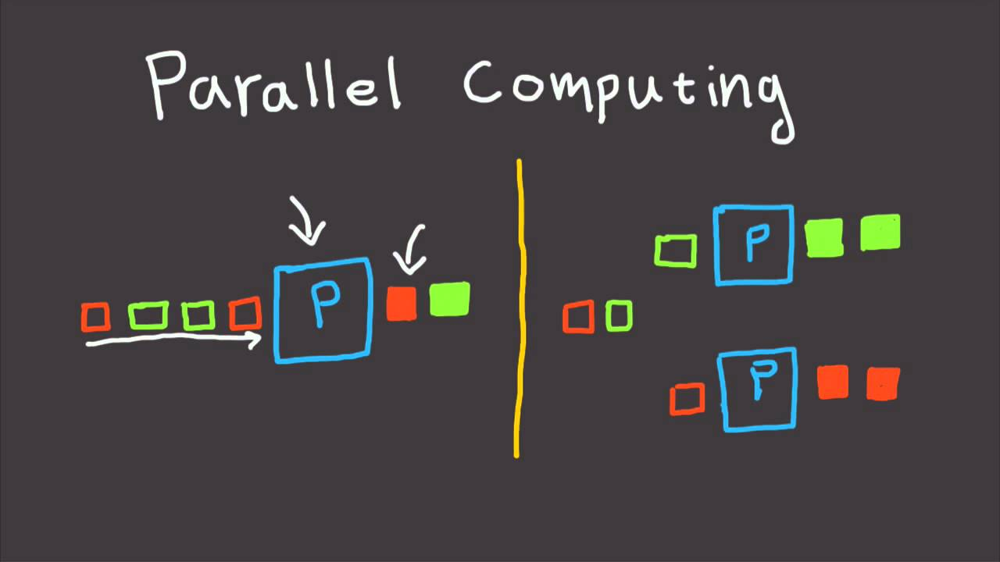

# Awesome Parallel Computing Resources 

A curated list of awesome parallel computing resources. 
Please feel free to update this page through [submitting pull requests][GitHub pull requests] or 
[emailing me][email me].

## Table of Contents

 - [Software](#software)
 - [Presentations](#presentations)
 - [Learning Resources](#learning-resources)
 - [Datasets](#datasets)
 - [Links](#links)

All the lists in this page are either in alphabetical order or chronological order.

## Software

#### Programming Library
- [CAF: An Open Source Implementation of the Actor Model in C++](https://github.com/actor-framework/actor-framework)
- [Chapel: A Programming Language for Productive Parallel Computing on Large-scale Systems](https://chapel-lang.org/)
- [Cilk Plus: C/C++ Extension for Data and Task Parallelism](https://www.cilkplus.org/)
- [Cpp-Taskflow: A Modern C++ Parallel Task Programming Library](https://github.com/cpp-taskflow/cpp-taskflow)
- [FastFlow: High-performance Parallel Patterns in C++](https://github.com/fastflow/fastflow)
- [Galois: A C++ Library to Ease Parallel Programming with Irregular Parallelism](https://github.com/IntelligentSoftwareSystems/Galois)
- [HPX: A C++ Standard Library for Concurrency and Parallelism](https://github.com/STEllAR-GROUP/hpx)
- [Intel TBB: Threading Building Blocks](https://www.threadingbuildingblocks.org/)
- [Kokkos: A C++ Programming Model for Writing Performance Portable Applications on HPC platforms](https://github.com/kokkos/kokkos)
- [OpenMP: Multi-platform Shared-memory Parallel Programming in C/C++ and Fortran](https://www.openmp.org/)
- [RaftLib: A C++ Library for Enabling Stream and Dataflow Parallel Computation](https://github.com/RaftLib/RaftLib) 
- [STAPL: Standard Template Adaptive Parallel Programming Library in C++](https://parasol.tamu.edu/stapl/)
- [STLab: High-level Constructs for Implementing Multicore Algorithms with Minimized Contention](http://stlab.cc/libraries/concurrency/)
- [Transwarp: A Header-only C++ Library for Task Concurrency](https://github.com/bloomen/transwarp)

#### Concurrent Data Structures

- [Boost.Lockfree: Thread-safe and Lock-free Containers](https://github.com/boostorg/lockfree)
- [ConcurrentQueue: A Fast Multi-producer Multi-consumer Lock-free Concurrent Queue in C++](https://github.com/cameron314/concurrentqueue)
- [libcds: A C++ library of Concurrent Data Structures](https://github.com/khizmax/libcds)
- [Parallel-Hashmap: A Header-only Very Fast and Memory-friendly Hash Map](https://github.com/greg7mdp/parallel-hashmap)
- [ReaderWriterQueue: A Fast Single-producer Single-consumer Lock-free Queue in C++](https://github.com/cameron314/readerwriterqueue)
- [xenium: A C++ library Providing Various Concurrent Data Structures and Reclamation Schemes](https://github.com/mpoeter/xenium)

#### Coroutine and Fiber

- [Boost.Fiber: A Framework for Userland-threads Programming and Scheduling](https://github.com/boostorg/fiber)
- [cppcoro: A Library for C++ Coroutines Abstractions for the Coroutines TS](https://github.com/lewissbaker/cppcoro)
- [Fiber Tasking Lib: A Library for Enabling Task-based Multi-threading using Fibers](https://github.com/RichieSams/FiberTaskingLib)
- [coro-async: A lite C++ coroutine TS based networking library](https://github.com/arun11299/coro-async)

## Presentations

#### Generic Parallel Computing Topics

- [Is Parallel Programming still Hard?](https://www.youtube.com/watch?v=YM8Xy6oKVQg) - P. McKenney, M. Michael, and M. Wong at CppCon 2017
- [The Speed of Concurrency: Is Lock-free Faster?](https://www.youtube.com/watch?v=9hJkWwHDDxs) - Fedor G Pikus in CppCon 2016

#### Scheduling in Parallel Processing

- [Expressing Parallelism in C++ with Threading Building Blocks](https://www.youtube.com/watch?v=9Otq_fcUnPE) - Mike Voss at Intel Webinar 2018
- [A Work-stealing Runtime for Rust](https://www.youtube.com/watch?v=4DQakkJ8XLI) - Aaron Todd in Air Mozilla 2017

#### Memory Model

- [C++11/14/17 atomics and memory model: Before the story consumes you](https://www.youtube.com/watch?v=DS2m7T6NKZQ) - Michael Wong in CppCon 2015
- [The C++ Memory Model](https://www.youtube.com/watch?v=gpsz8sc6mNU) - Valentin Ziegler at C++ Meeting 2014

## Learning Resources

#### Books

- [C++ Concurrency in Action: Practical Multithreading](https://www.manning.com/books/c-plus-plus-concurrency-in-action) - Anthony Williams 2012
- [The Art of Multiprocessor Programming](https://www.amazon.com/Art-Multiprocessor-Programming-Revised-Reprint/dp/0123973376/ref=sr_1_1?ie=UTF8&qid=1438003865&sr=8-1&keywords=maurice+herlihy) - Maurice Herlihy 2012

#### Tutorials

- [Parallel Computing Training Tutorials](https://hpc.llnl.gov/training/tutorials) - Lawrence Livermore National Laboratory

#### Research Papers

- [The Landscape of Parallel Computing Research: A View from Berkeley](https://www2.eecs.berkeley.edu/Pubs/TechRpts/2006/EECS-2006-183.pdf)

#### Courses

- [CS6290 High-performance Computer Architecture](https://www.udacity.com/course/high-performance-computer-architecture--ud007) - Milos Prvulovic and Catherine Gamboa at George Tech

## Datasets

- [HPEC Graph Challenge](https://graphchallenge.mit.edu/)
- [PARRSEC Benchmark Suite for the Analysis of Multithreaded Programs](https://parsec.cs.princeton.edu/)

## Links

#### Blogs
 - [1024 Cores](http://www.1024cores.net/) - Dmitry Vyukov 
 - [Michael Wong's Standard on Parallelism and Programming Languages](https://wongmichael.com/about/) - Michael Wong
 - [Preshing on Programming](https://preshing.com/) - Jeff Preshing
 - [Sutter's Mill](https://herbsutter.com/) - Herb Sutter

#### Journals
 - [IEEE Transactions on Parallel and Distributed Systems (TPDS)](https://www.computer.org/csdl/journal/td) 
 - [Journal of Parallel and Distributed Computing](https://www.journals.elsevier.com/journal-of-parallel-and-distributed-computing)
  
#### Conferences

 - [ACM SIGPLAN Annual Symposium on Principles and Practice of Parallel Programming (PPoPP)](https://ppopp19.sigplan.org/home)
 - [ACM Symposium on Parallel Algorithms and Architectures (SPAA)](https://spaa.acm.org/)
 - [ACM/IEEE International Conference for High-performance Computing, Networking, Storage, and Analysis (SC)](https://sc19.supercomputing.org/)
 - [IEEE International Parallel and Distributed Processing Symposium (IPDPS)](http://www.ipdps.org/)
 - [International Conference on Parallel Processing (ICPP)](https://www.hpcs.cs.tsukuba.ac.jp/icpp2019/)

* * *

[GitHub pull requests]:  https://github.com/cpp-taskflow/cpp-taskflow/pulls
[email me]:              mailto:twh760812@gmail.com

