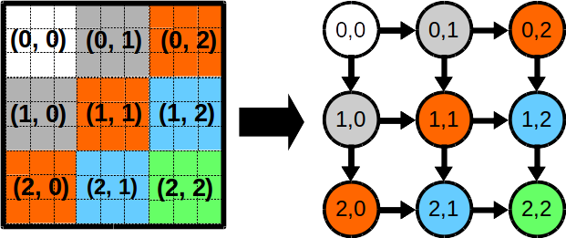

# Wavefront

This page we compare the three implementations of wavefront computing pattern using OpenMP, Intel-TBB and Cpp-Taskflow.
The wavefront computing pattern is from the blog in [Intel Developer Zone]. 



As shown in the figure, we partition a 2D matrix into a set of identical square sub-matrices (blocks). 
Each submatrix is mapped to a task that performs a linear scan through each element and 
apply some arithmetic calculation. The wavefront propagates the block dependency diagonally 
from the top-left submatrix to the bottom-right submatrix. Each block precedes two blocks, one to the
right and another below. The blocks with the same color can run concurrently.


+ [OpenMP](#OpenMP)
+ [Intel-TBB](#TBB)
+ [Cpp-Taskflow](#Cpp-Taskflow)

# OpenMP 

```cpp
1:  // MB, NB: number of blocks in the two dimensions. B: dimension of a block
2:  // matrix: the given 2D matrix 
3:  // D: dependency matrix 
4:  void wavefront(size_t MB, size_t NB, size_t B, double** matrix, int** D){
5:    omp_set_num_threads(std::thread::hardware_concurrency());
6:    #pragma omp parallel
7:    {
8:      #pragma omp single
9:      {
10:       for(int i=0; i<MB; i++){
11:         for(int j=0; j<NB; j++) {
12:           if(i > 0 && j > 0){
13:             #pragma omp task depend(in:D[i-1][j], D[i][j-1]) depend(out:D[i][j]) firstprivate(i, j)
14:             block_computation(matrix, B, i, j);
15:           }
16:           // Top left corner
17:           else if(i == 0 && j == 0){
18:             #pragma omp task depend(out:D[i][j]) firstprivate(i, j)
19:             block_computation(matrix, B, i, j);
20:           }
21:           // Top edge  
22:           else if(j+1 <= NB && i == 0 && j > 0){
23:             #pragma omp task depend(in:D[i][j-1]) depend(out:D[i][j]) firstprivate(i, j)
24:             block_computation(matrix, B, i, j);
25:           }
26:           // Left edge
27:           else if(i+1 <= MB && i > 0 && j == 0){
28:             #pragma omp task depend(in:D[i-1][j]) depend(out:D[i][j]) firstprivate(i, j)
29:             block_computation(matrix, B, i, j);
30:           }
31:           // Bottom right corner
32:           else{
33:             #pragma omp task depend(in:D[i-1][j] ,D[i][j-1]) firstprivate(i, j)
34:             block_computation(matrix, B, i, j);
35:           }
36:         } // End of inner loop
37:       }  // End of outer loop
38:     } // End of omp single 
39:   } // End of omp parallel 
40: }
```

This function shows the wavefront computing implemented using OpenMP. Each
block is delegated to a OpenMP task. For each task we need to explicitly specify both the
input and output depedency and an additional depedency matrix `D` is
created for this purpose.


# Intel-TBB

```cpp 
1:  using namespace tbb;
2:  using namespace tbb::flow;
3:  
4:  // MB, NB: number of blocks in the two dimensions. B: dimension of a block
5:  // matrix: the given 2D matrix   
6:  // nodes: the nodes in flow graph
7:  // G: Intel-TBB flow graph
8:  void wavefront(size_t MB, size_t NB, size_t B, double** matrix, continue_node<continue_msg> ***nodes, Graph& G){ 
9:   for(int i=MB; --i>=0;) { 
10:     for(int j=NB; --j>=0;) {
11:       node[i][j] = new tbb::flow::continue_node<tbb::flow::continue_msg>(G,
12:         [=](const continue_msg&) {
13:           block_computation(matrix, i, j); 
14:       });
15:       if(i+1 < MB) {
16:          make_edge(*node[i][j], *node[i+1][j]);
17:       }
18:       if(j+1 < NB) {
19:          make_edge(*node[i][j], *node[i][j+1]);
20:       } 
21:     } // End of inner loop
22:   } // End of outer loop
23:  
24:   nodes[0][0]->try_put(continue_msg());
25:   G.wait_for_all();
26: }
```

This function shows the wavefront computing implemented using Intel-TBB flow graph. We 
build a depedency graph using the `continue_node` type in TBB flow graph and delegate 
each block to a node. The `make_edge` function specifies the depedency between two nodes 
and calling `wait_for_all` to wait until all computations complete.

# Cpp-Taskflow

```cpp 
1:  // MB, NB: number of blocks in the two dimensions. B: dimension of a block
2:  // matrix: the given 2D matrix   
3:  // tasks: the placeholders for tasks in Taskflow
4:  // tf: Taskflow object
5:  void wavefront(size_t MB, size_t NB, size_t B, double** matrix, std::vector<std::vector<tf::Task>>& tasks, tf::Taskflow& tf){ 
6:    for(int i=MB; --i>=0;) { 
7:      for(int j=NB; --j>=0;) { 
8:        task[i][j].work([=]() {
9:          block_computation(matrix, B, i, j); 
10:       });  
11:       if(j+1 < NB) {
12:         task[i][j].precede(task[i][j+1]);
13:       }
14:       if(i+1 < MB) {
15:         task[i][j].precede(task[i+1][j]);
16:       }
17:     } // End of inner loop
18:   } // End of outer loop
19:
20:   tf.wait_for_all();
21: }
```
This function shows the wavefront computing implemented using Cpp-Taskflow. We
delegate each block to a `tf::Task` and use the `precede` function to specify
the dependency between tasks. The `tf.wait_for_all()` blocks until all tasks
are executed.


* * *

[GraphvizOnline]:        https://dreampuf.github.io/GraphvizOnline/
[Intel Developer Zone]:  https://software.intel.com/en-us/blogs/2011/09/09/implementing-a-wave-front-computation-using-the-intel-threading-building-blocks-flow-graph
