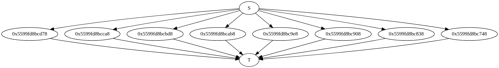

# Parallelize a For Loop

In this tutorial, we are going to demonstrate how to use Cpp-Taskflow
to run a for loop in parallel.

+ [Range-based Loop over a Container](#Range-based-Loop-over-a-Container)
+ [Index-based For Loop](#Index-based-For-Loop)

# Range-based Loop over a Container

Cpp-Taskflow has a STL-style method `parallel_for` 
that takes a range of items and applies a callable to each of the item in parallel.
The method constructs a sub-graph representing this workload
and returns a task pair as synchronization points.

```cpp
 1: #include <taskflow/taskflow.hpp>
 2:
 3: int main() {
 4:
 5:   tf::Taskflow tf(4);
 6:
 7:   std::vector<int> items {1, 2, 3, 4, 5, 6, 7, 8};
 8:
 9:   auto [S, T] = tf.parallel_for(items.begin(), items.end(), [] (int item) {
10:     std::cout << std::this_thread::get_id() << " runs " << item << std::endl;
11:   });
12:
13:   S.work([] () { std::cout << "S\n"; }).name("S");
14:   T.work([] () { std::cout << "T\n"; }).name("T");
15:
16:   std::cout << tf.dump();
17:
18:   tf.wait_for_all();
19:
20:   return 0;
21: }
```

The above code generate the following task dependency graph. 
The label 0x56\* represents an internal node to execute the callable.
By default, Cpp-Taskflow evenly partitions and distributes the workload 
to all threads.
In our example of eight tasks and four workers, each internal node is responsible for two items.


Debrief:
+ Line 5 creates a taskflow object of four worker threads
+ Line 7 creates a vector container of eight items
+ Line 9-11 creates a parallel execution graph using the method `parallel_for`
+ Line 13-14 names the synchronization tasks `S` and `T`
+ Line 16 dumps the graph to a dot format which can be visualized through [GraphvizOnline][GraphVizOnline]
+ Line 18 dispatches the graph to execution and blocks until the graph finishes

Here is one possible output of this program:

```bash
S
139931471636224 runs 1
139931471636224 runs 2
139931480028928 runs 7
139931480028928 runs 8
139931496814336 runs 3
139931496814336 runs 4
139931488421632 runs 5
139931488421632 runs 6
T
```

## Partition the Workload Explicitly

By default, Cpp-Taskflow partitions the workload evenly across the workers.
In some cases, it is useful to disable this feature and apply user-specified partition.
The method `parallel_for` has an overload that takes an extra unsigned integer as 
the number of items in each partition.

```cpp
auto [S, T] = tf.parallel_for(items.begin(), items.end(), [] (int item) {
  std::cout << std::this_thread::get_id() << " runs " << item << std::endl;
}, 1);
```

The above example will force each partition to run exactly one item.
This can be useful when you have unbalanced workload
and would like to enable more efficient parallelization.



## Construct the Graph Manually

You can manually construct a dependency graph that represents a parallel execution 
of a for loop
using only the basic methods `silent_emplace` and `precede`.


```cpp
auto S = tf.silent_emplace([] () {}).name("S");
auto T = tf.silent_emplace([] () {}).name("T");

for(auto item : items) {
  auto task = tf.silent_emplace([item] () {
    std::cout << std::this_thread::get_id() << " runs " << item << std::endl;
  });
  S.precede(task);
  task.precede(T);
}
```

# Index-based For Loop

To parallelize a for loop based on index, you can use the capture feature of C++ lambda.

```cpp
auto S = tf.silent_emplace([] () {}).name("S");
auto T = tf.silent_emplace([] () {}).name("T");

for(int i=0; i<8; ++i) {
  auto task = tf.silent_emplace([i] () {
    std::cout << std::this_thread::get_id() << " runs " << i << std::endl;
  }); 
  S.precede(task);
  task.precede(T);
}
```

* * *

[GraphViz]:              https://www.graphviz.org/
[GraphVizOnline]:        https://dreampuf.github.io/GraphvizOnline/

